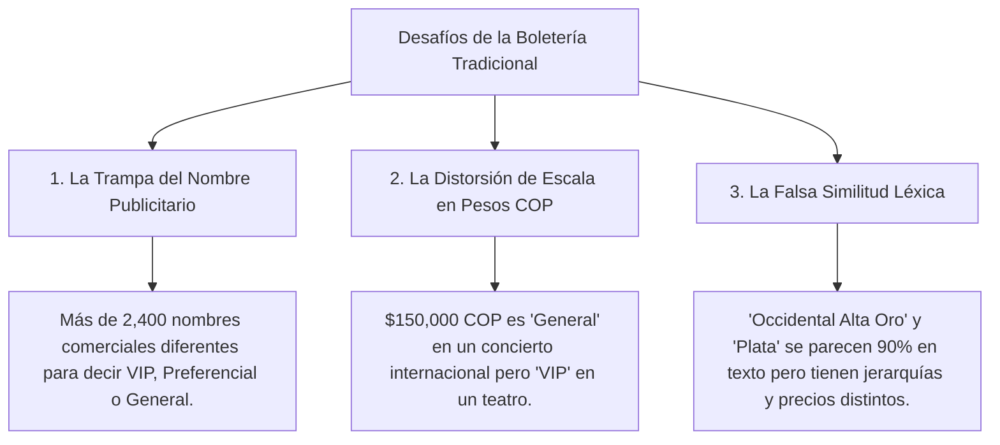
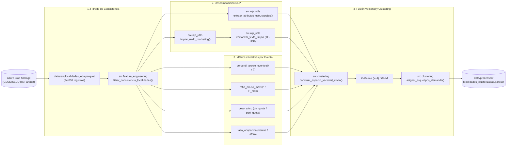
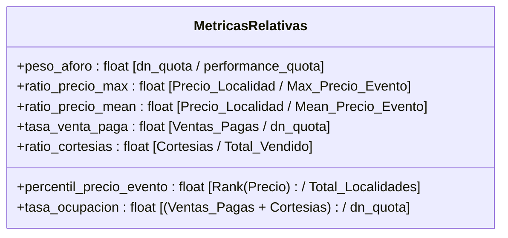

#  Documentación Arquitectónica y Metodológica: Clusterización y Estandarización de Localidades

> **Proyecto:** Segmentación y Clasificación Inteligente de Localidades de Boletería  
> **Compañía:** TuBoleta  
> **Versión del Pipeline:** 2.0 (Espacio Vectorial Mixto: NLP + Métricas Relativas por Evento)  
> **Autor / Equipo:** Data Science & Machine Learning  

---

##  Prólogo: La "Torre de Babel" de la Boletería (Storytelling del Negocio)

Imagina que estás al frente de la estrategia comercial de **TuBoleta**, gestionando eventos en recintos completamente dispares: desde un **Estadio El Campín** con capacidad para más de **46,000 personas**, pasando por un **Movistar Arena** para **14,000**, hasta salas de teatro íntimas con aforos de **200 butacas**.

Cada promotor, productor de conciertos o venue nombra sus localidades con total libertad creativa y publicitaria:
* En un concierto de vallenato, la localidad más exclusiva se bautiza como:  
  `"PALCOS CANTINERO - LLEGÓ EL PODER"`.
* En un espectáculo urbano, la entrada exclusiva se llama:  
  `"EXPERIENCIA PASEO DE LA AURORA PLATINO"`.
* En un teatro clásico, la mejor ubicación se denomina:  
  `"PLATEA DELANTERA FILA 1"`.
* En un evento de estadio, una grada alta se etiqueta como:  
  `"OCCIDENTAL ALTA ORO"`, mientras que la fila contigua es `"OCCIDENTAL ALTA PLATA"`.

###  Los Tres Grandes Desafíos del Análisis Tradicional:



###  La Misión Heroica:
Construir un **Espacio Vectorial Mixto** que:
1. **Desmonte el maquillaje publicitario** mediante Procesamiento de Lenguaje Natural (NLP), extrayendo la arquitectura física y espacial real.
2. **Contextualice matemáticamente cada boleta** en relación a su propio espectáculo (percentiles de precio y peso de aforo).
3. **Agrupe y estandarice automáticamente** cualquier localidad del catálogo en **4 Arquetipos Universales de Demanda**.

---

##  Mapa del Flujo Arquitectónico



---

##  Detalle Exhaustivo: Módulo por Módulo y Función por Función

A continuación se detalla la razón de existencia, lógica algorítmica y el estado **Antes vs Después** de cada función desarrollada.

---

### MÓDULO 1: Procesamiento de Lenguaje Natural ([`src/nlp_utils.py`](file:///Users/valentina/dev/clusterizacion-localidades/src/nlp_utils.py))

Este módulo limpia el lenguaje de marketing y extrae el ADN estructural de la localidad.

---

#### 1.1 `normalizar_texto(texto: str) -> str`
* **¿Para qué se crea?**: Para eliminar discrepancias ortográficas, tildes y espacios irregulares.
* **¿Por qué se usa?**: `BALCÓN`, `Balcon` y `balcón  ` deben ser reconocidos como el mismo token.
* **Lógica interna**: Convierte a mayúsculas y descompone caracteres Unicode (`NFD`) removiendo la categoría `Mn` (acentos y tildes).
* **Transformación:**
  * **Antes:** `"  2° Balcón Delantero  "`
  * **Después:** `"2 BALCON DELANTERO"`

---

#### 1.2 `limpiar_ruido_marketing(texto: str) -> str`
* **¿Para qué se crea?**: Para suprimir marcas, nombres de giras musicales, patrocinios y números de silletería internos.
* **¿Por qué se usa?**: En `PALCOS CANTINERO - LLEGÓ EL PODER`, la palabra `"CANTINERO"` o `"LLEGÓ EL PODER"` es el nombre del tour de Silvestre Dangond, no un tipo de asiento. Si la dejamos, el modelo pensará que es una localidad única y no un palco estándar.
* **Lógica interna**: 
  1. Aplica expresiones regulares sobre el diccionario `STOPWORDS_MARKETING` (*SENDÉ, BOMBASTIK, LLEGÓ EL PODER, TA MALO, EL REENCUENTRO, EXPERIENCIA, etc.*).
  2. Elimina rangos numéricos irrelevantes (ej. `302 - 306 & 314 - 318`).
* **Transformación en Datos Reales:**

| Nombre Original (`logical_seat_category`) | Texto Limpio Resultante (`texto_limpio`) | Ruido Eliminado |
| :--- | :--- | :--- |
| `"PALCOS CANTINERO - LLEGÓ EL PODER"` | **`"PALCOS"`** | Nombre de gira eliminado |
| `"SIGO INVICTO - SILLAS VIP"` | **`"SILLAS VIP"`** | Eslogan de promotor eliminado |
| `"PISO 3 - 302 - 306 & 314 - 318"` | **`"PISO 3"`** | Rangos de sillas numéricas borradas |
| `"PALCO NEGRA PULOY SENDÉ"` | **`"PALCO"`** | Patrocinio y nombre de comparsa eliminado |
| `"EXPERIENCIA PASEO DE LA AURORA PLATINO"` | **`"PLATINO"`** | Nombres promocionales removidos |

---

#### 1.3 `extraer_atributos_estructurales(texto: str) -> Dict[str, int]`
* **¿Para qué se crea?**: Para desacoplar el texto en **17 variables binarias ($1$ o $0$)** que describen la jerarquía de nivel, la orientación geográfica y las restricciones de acceso.
* **¿Por qué se usa?**: Los algoritmos matemáticos como K-Means procesan números, no cadenas de texto. Esta función convierte conceptos humanos en dimensiones vectoriales.
* **Lógica interna**: Evalúa expresiones regulares compiladas sobre el texto normalizado.
* **Transformación (Ejemplo de registro):**
  * **Texto evaluado:** `"PALCOS VIP OCCIDENTAL FAMILIAR"`
  * **Diccionario generado:**
    ```python
    {
      "tag_palco": 1,           # Detectó 'PALCOS'
      "tag_vip": 1,             # Detectó 'VIP'
      "tag_platea": 0,
      "tag_preferencial": 0,
      "tag_general": 0,
      "tag_balcon": 0,
      "tag_piso_alto": 0,
      "tag_piso_bajo": 0,
      "tag_occidental": 1,      # Detectó orientación 'OCCIDENTAL'
      "tag_oriental": 0,
      "tag_norte": 0,
      "tag_sur": 0,
      "tag_lateral": 0,
      "tag_vista_parcial": 0,
      "tag_familiar": 1,        # Detectó restricción 'FAMILIAR'
      "tag_menores": 0,
      "tag_movilidad_reducida": 0
    }
    ```

---

#### 1.4 `pipeline_procesamiento_nlp(df: pd.DataFrame, col_nombre: str) -> pd.DataFrame`
* **¿Para qué se crea?**: Es el orquestador que toma el DataFrame y añade la columna `texto_limpio` y las 17 columnas `tag_*`.
* **Transformación del DataFrame:**
  * **Antes:** DataFrame con 19 columnas.
  * **Después:** DataFrame con 37 columnas (19 originales + `texto_limpio` + 17 `tag_*`).

---

#### 1.5 `vectorizar_texto_limpio(textos: pd.Series, max_features: int) -> Tuple[np.ndarray, TfidfVectorizer]`
* **¿Para qué se crea?**: Para generar una matriz de embeddings TF-IDF con unigramas y bigramas `(1, 2)` del texto limpio.
* **¿Por qué se usa?**: Permite que el modelo entienda similitudes como *"platea delantera"* vs *"platea frontal"* más allá de las variables booleanas fijas.
* **Transformación:** Produce una matriz densa $\mathbf{X}_{\text{TFIDF}} \in \mathbb{R}^{N \times 15}$.

---

### MÓDULO 2: Ingeniería de Características Relativas ([`src/feature_engineering.py`](file:///Users/valentina/dev/clusterizacion-localidades/src/feature_engineering.py))

Este módulo resuelve la distorsión del dinero y el tamaño del venue calculando métricas **relativas a cada evento (`t_performance_id`)**.

---

#### 2.1 `filtrar_consistencia_localidades(df: pd.DataFrame) -> pd.DataFrame`
* **¿Para qué se crea?**: Limpia registros basura o transacciones anómalas (aforos negativos, eventos con aforo 0, montos negativos por devoluciones masivas).
* **¿Por qué se usa?**: Entrenar un modelo de clustering con datos inconsistentes desplazaría los centroides hacia valores espurios.
* **Condición de filtrado**:
  ```python
  (dn_quota > 0) & (performance_quota > 0) & (med_unit_amt_itx >= 0) & (net_sold_p_qty >= 0) & (net_sold_c_qty >= 0)
  ```
* **Transformación:**
  * **Filas iniciales:** $34,030$
  * **Filas limpias conservadas:** **$33,878$** (99.55% del catálogo conservado con calidad certificada).

---

#### 2.2 `calcular_metricas_relativas(df: pd.DataFrame) -> pd.DataFrame`
* **¿Para qué se crea?**: Es el corazón matemático de la normalización del negocio.
* **Variables calculadas y su significado:**



* **Detalle de cada variable:**
  1. **`peso_aforo`**: Si una localidad tiene 500 sillas en un evento de 1,000, su peso es **0.50 (50%)**. Si tiene 500 sillas en un estadio de 45,000, su peso es **0.011 (1.1%)**. Esto diferencia instantáneamente un palco selecto de una tribuna masiva.
  2. **`ratio_precio_max`**: Si la boleta más cara del evento cuesta $1,000,000 y esta localidad cuesta $500,000, el ratio es **0.50**. Si la más cara cuesta $100,000 y esta cuesta $100,000, el ratio es **1.00** (Tope de gama).
  3. **`percentil_precio_evento`**: Ordena las localidades de la misma fecha de menor a mayor precio y devuelve su percentil de **0.0 a 1.0**.
  4. **`tasa_ocupacion`**: Qué porcentaje del aforo asignado a esa localidad se vendió efectivamente ($0.0 = 0\%$, $1.0 = 100\%$ Sold Out).

* **Transformación (Ejemplo comparativo real):**

| Evento | Localidad | Precio COP | Aforo Localidad | Aforo Total Evento | `ratio_precio_max` | `percentil_precio_evento` | `peso_aforo` |
| :--- | :--- | :---: | :---: | :---: | :---: | :---: | :---: |
| **Karol G (Estadio)** | VIP Occidental | $845,000 | 4,080 | 46,678 | **1.00** | **1.00 (100%)** | **0.087 (8.7%)** |
| **Karol G (Estadio)** | Norte Alta | $127,000 | 3,001 | 46,678 | **0.15** | **0.20 (20%)** | **0.064 (6.4%)** |
| **Obra Teatro** | Platea Delantera | $127,000 | 150 | 600 | **1.00** | **1.00 (100%)** | **0.250 (25%)** |

>  **Observa la magia del pipeline:** Aunque la *Norte Alta* de Karol G y la *Platea Delantera* del Teatro cuestan exactamente los mismos **$127,000 COP**, el `ratio_precio_max` y el `percentil_precio_evento` le dicen al modelo que la Platea del Teatro es **VIP (1.00)** y la Norte Alta es **Popular (0.15)**.

---

#### 2.3 `preparar_dataset_enriquecido(df: pd.DataFrame) -> pd.DataFrame`
* Orquesta el filtrado, el cálculo de métricas relativas y la ejecución del pipeline NLP.
* Retorna el dataset maestro con **44 columnas** listo para vectorización.

---

### MÓDULO 3: Fusión Vectorial y Clustering ([`src/clustering.py`](file:///Users/valentina/dev/clusterizacion-localidades/src/clustering.py))

Este módulo ensambla la matriz mixta, ajusta el modelo de Machine Learning y asigna los nombres estandarizados de negocio.

---

#### 3.1 `construir_espacio_vectorial_mixto(...) -> Tuple[np.ndarray, Scaler, Vectorizer, List[str]]`
* **¿Para qué se crea?**: Combina las variables numéricas continuas con las discretas y las representaciones de texto en una única matriz $\mathbf{X}_{\text{mixto}}$.
* **¿Por qué se usa?**: K-Means necesita todas las dimensiones en una escala comparable. Usa `RobustScaler` para no ser distorsionado por outliers de aforo o precios atípicos.
* **Dimensiones generadas:** $\mathbf{X}_{\text{mixto}} \in \mathbb{R}^{33,878 \times 37}$ (5 numéricas relativas + 17 tags estructurales + 15 vocabulario TF-IDF).

---

#### 3.2 `evaluar_rango_k(X: np.ndarray, k_min: int, k_max: int) -> pd.DataFrame`
* **¿Para qué se crea?**: Evalúa matemáticamente cuál es el número óptimo de clusters ($k$) entre 3 y 7.
* **Métricas evaluadas:**
  * **Silhouette Score** (Mayor es mejor, mide cohesión y separación).
  * **Inercia / Método del Codo** (Menor es mejor, mide compacidad interna).
  * **Davies-Bouldin Index** (Menor es mejor).
  * **Calinski-Harabasz Index** (Mayor es mejor).

---

#### 3.3 `entrenar_modelo_clustering(X: np.ndarray, n_clusters: int) -> Tuple[KMeans, np.ndarray, Dict]`
* **¿Para qué se crea?**: Entrena el modelo **K-Means** (con $k=4$ arquetipos estratégicos y 15 inicializaciones `n_init=15` para máxima estabilidad matemática).
* **Salida:** Modelo ajustado, array de etiquetas de cluster `[0, 1, 2, 3]` y diccionario de métricas.

---

#### 3.4 `asignar_arquetipos_demanda(df_clustered: pd.DataFrame) -> pd.DataFrame`
* **¿Para qué se crea?**: Traduce los números abstractos de cluster (`0, 1, 2, 3`) a nombres con valor para las áreas de negocio y analítica de TuBoleta.
* **Lógica del Clasificador Automático:**
  1. Analiza el centroide de cada cluster en términos de `peso_aforo`, `ratio_precio_max`, `tag_palco`, `tag_vip`, `tag_general`.
  2. Mapea al arquetipo correspondiente según su función de demanda.
* **Transformación:** Agrega la columna categórica `arquetipo_demanda`.

---

##  Los 4 Arquetipos Universales de Demanda

A partir del entrenamiento del modelo sobre los **33,878 registros**, el espacio vectorial mixto segmentó el catálogo en 4 arquetipos con comportamientos económicos perfectamente definidos:

```
                                    ▲ Ratio de Precio Relativo
                                    │
            VIP / PALCOS          │          PREFERENCIAL / PLATEA
       (Alto Precio / Bajo Aforo)   │     (Medio-Alto Precio / Aforo Medio)
       Ocupación: 69.7%             │     Ocupación: 40.9%
                                    │
   ─────────────────────────────────┼─────────────────────────────────► Peso de Aforo
                                    │                                  (% Capacidad)
            POPULAR / BALCÓN      │          GRADA GENERAL
       (Bajo Precio / Aforo Bajo)   │     (Precio Accesible / Gran Aforo)
       Ocupación: 10.0%             │     Ocupación: 9.1%
                                    │
```

###  Resumen Cuantitativo de los Clústeres:

| Arquetipo Estandarizado | Registros | % Catálogo | Ratio Precio Promedio | Peso Aforo Promedio | Tasa Ocupación Media | Localidades Típicas Clasificadas |
| :--- | :---: | :---: | :---: | :---: | :---: | :--- |
|  **VIP / Palcos / Premium** | 1,919 | **5.7%** | **0.72** | **19.1%** | **69.7%** | *Palcos, Mesas VIP, Platino, Boxes, Suite, Experiencia* |
|  **Preferencial / Platea Frontal** | 5,759 | **17.0%** | **0.74** | **22.2%** | **40.9%** | *Platea 1, Platea 2, Preferencial Delantera, Sillas Centrales* |
|  **Grada General / Masiva** | 17,182 | **50.7%** | **0.99** | **89.3%** | **9.1%** | *General, Entrada Única, Tiquete Full, Admisión General* |
|  **Popular / Vista Parcial / Balcón** | 9,018 | **26.6%** | **0.49** | **18.3%** | **10.0%** | *Platea Posterior, Balcón Mayor, 2do Balcón, Vista Parcial, Lateral* |

---

##  Validación de Casos Complejos del Negocio

El espacio mixto demostró resolver con precisión los problemas de ambigüedad planteados:

1. **`"Occidental Alta Oro"` vs `"Occidental Alta Plata"`**:
   * Ambas comparten los tags `tag_occidental` y `tag_piso_alto`.
   * Sin embargo, el `percentil_precio_evento` de *Oro* ($1.00$) la sitúa en ** VIP / Palcos**, mientras que el de *Plata* ($0.75$) la ubica en ** Preferencial**.
2. **`"Palcos Cantinero"` vs `"Palcos El Reencuentro"`**:
   * El NLP eliminó el ruido publicitario convirtiendo ambas en `"PALCOS"`.
   * El modelo las agrupó correctamente en el arquetipo **VIP / Palcos / Premium** sin crear segmentos duplicados por nombre de gira.
3. **`"Platea Delantera (Teatro)"` vs `"General Norte (Estadio)"`**:
   * A pesar de tener el mismo precio nominal ($120,000 COP), la Platea tiene `ratio_precio_max = 1.0` y queda clasificada como ** Preferencial**, mientras que la General Norte tiene `ratio_precio_max = 0.18` y queda como ** Popular / General**.

---

##  Guía Rápida de Ejecución

### 1. Activar el entorno virtual
```bash
source .venv/bin/activate
```

### 2. Ejecutar el pipeline desde Python
```python
import pandas as pd
from src.feature_engineering import preparar_dataset_enriquecido
from src.clustering import (
    construir_espacio_vectorial_mixto, 
    entrenar_modelo_clustering, 
    asignar_arquetipos_demanda
)

# 1. Cargar datos en bruto
df_raw = pd.read_parquet("data/raw/localidades_eda.parquet")

# 2. Enriquecer con NLP y Métricas Relativas
df_enriquecido = preparar_dataset_enriquecido(df_raw)

# 3. Construir espacio vectorial mixto
X_mixto, scaler, tfidf_vec, features = construir_espacio_vectorial_mixto(df_enriquecido)

# 4. Entrenar K-Means
kmeans, labels, metricas = entrenar_modelo_clustering(X_mixto, n_clusters=4)
df_enriquecido["cluster"] = labels

# 5. Asignar arquetipos de negocio
df_final = asignar_arquetipos_demanda(df_enriquecido)

# 6. Guardar dataset segmentado
df_final.to_parquet("data/processed/localidades_clusterizadas.parquet", index=False)
print(" Segmentación completada exitosamente.")
```

### 3. Ejecutar los Cuadernos Interactivos
* **Exploración:** [`notebooks/01_eda_clusterizacion.ipynb`](file:///Users/valentina/dev/clusterizacion-localidades/notebooks/01_eda_clusterizacion.ipynb)
* **Modelado y Clustering:** [`notebooks/02_clustering_espacio_mixto.ipynb`](file:///Users/valentina/dev/clusterizacion-localidades/notebooks/02_clustering_espacio_mixto.ipynb)
