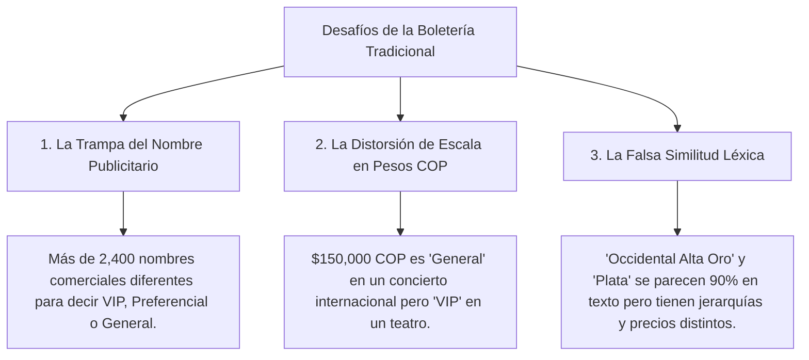
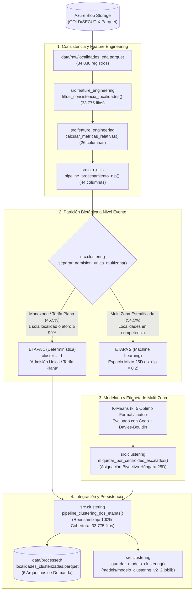
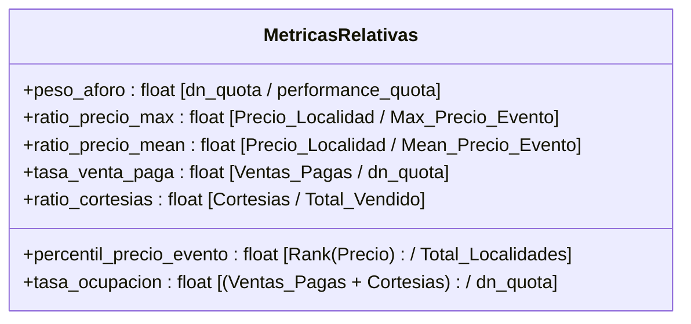

#  Documentación Arquitectónica y Metodológica: Clusterización y Estandarización de Localidades

> **Proyecto:** Segmentación y Clasificación Inteligente de Localidades de Boletería  
> **Compañía:** TuBoleta  
> **Versión del Pipeline:** 2.2 (Pipeline Bietápico: Partición Monozona + Espacio Mixto 25D, ω=0.2, k=5)  
> **Autor / Equipo:** Data Science & Machine Learning  

---

##  Prólogo: La "Torre de Babel" de la Boletería (Storytelling del Negocio)

Imagina que estás al frente de la estrategia comercial de **TuBoleta**, gestionando eventos en recintos completamente dispares: desde un **Estadio El Campín** con capacidad para más de **46,000 personas**, pasando por un **Movistar Arena** para **14,000**, hasta salas de teatro íntimas con aforos de **200 butacas**.

Cada promotor, productor de conciertos o venue nombra sus localidades con total libertad creativa y publicitaria:
* En un concierto de vallenato, la localidad más exclusiva se bautiza como:  
  `"PALCOS CANTINERO - LLEGÓ EL PODER"`.
* En un espectáculo urbano, la entrada exclusiva se llama:  
  `"EXPERIENCIA PASEO DE LA AURORA PLATINO"`.
* En un teatro clásico, la mejor ubicación se denomina:  
  `"PLATEA DELANTERA FILA 1"`.
* En un evento de estadio, una grada alta se etiqueta como:  
  `"OCCIDENTAL ALTA ORO"`, mientras que la fila contigua es `"OCCIDENTAL ALTA PLATA"`.

###  Los Tres Grandes Desafíos del Análisis Tradicional:



###  La Misión Heroica:
Construir un **Espacio Vectorial Mixto** que:
1. **Desmonte el maquillaje publicitario** mediante Procesamiento de Lenguaje Natural (NLP), extrayendo la arquitectura física y espacial real.
2. **Contextualice matemáticamente cada boleta** en relación a su propio espectáculo (percentiles de precio y peso de aforo).
3. **Agrupe y estandarice automáticamente** cualquier localidad del catálogo en **6 Arquetipos Estandarizados de Demanda (1 Admisión Única + 5 Multi-Zona)**.

---

##  Mapa del Flujo Arquitectónico



---

##  Detalle Exhaustivo: Módulo por Módulo y Función por Función

A continuación se detalla la razón de existencia, lógica algorítmica y el estado **Antes vs Después** de cada función desarrollada.

---

### MÓDULO 1: Procesamiento de Lenguaje Natural ([`src/nlp_utils.py`](src/nlp_utils.py))

Este módulo limpia el lenguaje de marketing y extrae el ADN estructural de la localidad.

---

#### 1.1 `normalizar_texto(texto: str) -> str`
* **¿Para qué se crea?**: Para eliminar discrepancias ortográficas, tildes y espacios irregulares.
* **¿Por qué se usa?**: `BALCÓN`, `Balcon` y `balcón  ` deben ser reconocidos como el mismo token.
* **Lógica interna**: Convierte a mayúsculas y descompone caracteres Unicode (`NFD`) removiendo la categoría `Mn` (acentos y tildes).
* **Transformación:**
  * **Antes:** `"  2° Balcón Delantero  "`
  * **Después:** `"2 BALCON DELANTERO"`

---

#### 1.2 `limpiar_ruido_marketing(texto: str) -> str`
* **¿Para qué se crea?**: Para suprimir marcas, nombres de giras musicales, patrocinios y números de silletería internos.
* **¿Por qué se usa?**: En `PALCOS CANTINERO - LLEGÓ EL PODER`, la palabra `"CANTINERO"` o `"LLEGÓ EL PODER"` es el nombre del tour de Silvestre Dangond, no un tipo de asiento. Si la dejamos, el modelo pensará que es una localidad única y no un palco estándar.
* **Lógica interna**: 
  1. Aplica expresiones regulares sobre el diccionario `STOPWORDS_MARKETING` (*SENDÉ, BOMBASTIK, LLEGÓ EL PODER, TA MALO, EL REENCUENTRO, EXPERIENCIA, etc.*).
  2. Elimina rangos numéricos irrelevantes (ej. `302 - 306 & 314 - 318`).
* **Transformación en Datos Reales:**

| Nombre Original (`logical_seat_category`) | Texto Limpio Resultante (`texto_limpio`) | Ruido Eliminado |
| :--- | :--- | :--- |
| `"PALCOS CANTINERO - LLEGÓ EL PODER"` | **`"PALCOS"`** | Nombre de gira eliminado |
| `"SIGO INVICTO - SILLAS VIP"` | **`"SILLAS VIP"`** | Eslogan de promotor eliminado |
| `"PISO 3 - 302 - 306 & 314 - 318"` | **`"PISO 3"`** | Rangos de sillas numéricas borradas |
| `"PALCO NEGRA PULOY SENDÉ"` | **`"PALCO"`** | Patrocinio y nombre de comparsa eliminado |
| `"EXPERIENCIA PASEO DE LA AURORA PLATINO"` | **`"PLATINO"`** | Nombres promocionales removidos |

---

#### 1.3 `extraer_atributos_estructurales(texto: str) -> Dict[str, int]`
* **¿Para qué se crea?**: Para desacoplar el texto en **17 variables binarias ($1$ o $0$)** organizadas en **4 dimensiones ortogonales independientes** (sin solapamientos léxicos ni tokens duplicados entre categorías).
* **¿Por qué se usa?**: Los algoritmos matemáticos como K-Means procesan números, no cadenas de texto. Esta función convierte conceptos semánticos en dimensiones vectoriales estructuradas.
* **Comportamiento Multi-Etiqueta (*Multi-hot Encoding*)**: Una misma localidad puede activar simultáneamente tags en dimensiones independientes (ej. Orientación + Nivel Vertical + Jerarquía Comercial + Restricción), lo cual describe con precisión su naturaleza sin forzarla a una sola etiqueta.
* **Estructura de las 4 Dimensiones Ortogonales:**
  1. **Dimensión 1 (Jerarquía Comercial / Tipo de Asiento):**
     * `tag_palco`: `PALCO`, `PALCOS`, `BOX`, `BOXES`, `SUITE`, `SUITES`, `MESA`, `MESAS`
     * `tag_vip`: `VIP`, `PLATINUM`, `PLATINO`, `PREMIUM`, `GOLD`, `DIAMANTE`, `ORO`, `PLATA`
     * `tag_platea`: `PLATEA`, `SILLAS`, `SILLERIA`, `PISTA`, `CANCHA`
     * `tag_preferencial`: `PREFERENCIAL`, `PREFERENTE`, `CENTRAL`, `FRONTAL`
     * `tag_general`: `GENERAL`, `TIQUETE`, `ENTRADA`, `STANDARD`, `NORMAL`, `ADMISION`
  2. **Dimensión 2 (Nivel Vertical y Arquitectura del Venue):**
     * `tag_balcon`: `BALCON`, `BALCONES`, `MEZZANINE`, `VOLADIZO` *(Exclusivo para estructuras de balcón de teatro; no solapa con pisos)*.
     * `tag_piso_alto`: `ALTA`, `ALTAS`, `PISO 2`, `PISO 3`, `PISO 4`, `PISO 5`, `SEGUNDO PISO`, `TERCER PISO`, `CUARTO PISO`, `POSTERIOR`, `ALTO`.
     * `tag_piso_bajo`: `BAJA`, `BAJAS`, `PISO 1`, `PRIMER PISO`, `PLANTA BAJA`, `DELANTERA`, `PRIMERA FILA`, `BAJO`.
  3. **Dimensión 3 (Orientación Espacial y Geografía en el Recinto):**
     * `tag_occidental`, `tag_oriental`, `tag_norte`, `tag_sur`, `tag_lateral`, `tag_vista_parcial`.
  4. **Dimensión 4 (Restricciones de Acceso y Audiencia):**
     * `tag_familiar`, `tag_menores`, `tag_movilidad_reducida`.
* **Transformación (Ejemplo de registro real multi-dimensional):**
  * **Texto evaluado:** `"OCCIDENTAL ALTA VIP FAMILIAR"`
  * **Diccionario generado:**
    ```python
    {
      # Dimensión 1: Jerarquía Comercial
      "tag_palco": 0,
      "tag_vip": 1,             # Detectó 'VIP'
      "tag_platea": 0,
      "tag_preferencial": 0,
      "tag_general": 0,
      
      # Dimensión 2: Nivel Vertical
      "tag_balcon": 0,          # Ya no solapa erróneamente
      "tag_piso_alto": 1,       # Detectó 'ALTA'
      "tag_piso_bajo": 0,
      
      # Dimensión 3: Orientación Espacial
      "tag_occidental": 1,      # Detectó orientación 'OCCIDENTAL'
      "tag_oriental": 0,
      "tag_norte": 0,
      "tag_sur": 0,
      "tag_lateral": 0,
      "tag_vista_parcial": 0,
      
      # Dimensión 4: Restricciones de Acceso
      "tag_familiar": 1,        # Detectó restricción 'FAMILIAR'
      "tag_menores": 0,
      "tag_movilidad_reducida": 0
    }
    ```

---

#### 1.4 `pipeline_procesamiento_nlp(df: pd.DataFrame, col_nombre: str) -> pd.DataFrame`
* **¿Para qué se crea?**: Es el orquestador que toma el DataFrame y añade la columna `texto_limpio` y las 17 columnas `tag_*`.
* **Transformación del DataFrame:**
  * **Antes:** DataFrame con 26 columnas relativas (`df_rel`).
  * **Después:** DataFrame con 44 columnas (26 relativas + `texto_limpio` + 17 `tag_*`).

---

#### 1.5 `vectorizar_texto_limpio(textos: pd.Series, max_features: int) -> Tuple[np.ndarray, TfidfVectorizer]`
* **¿Para qué se crea?**: Para generar una matriz de embeddings TF-IDF con unigramas y bigramas `(1, 2)` del texto limpio.
* **¿Por qué se usa?**: Permite que el modelo entienda similitudes como *"platea delantera"* vs *"platea frontal"* más allá de las variables booleanas fijas.
* **Transformación:** Produce una matriz densa $\mathbf{X}_{\text{TFIDF}} \in \mathbb{R}^{N \times 15}$.

---

### MÓDULO 2: Ingeniería de Características Relativas ([`src/feature_engineering.py`](src/feature_engineering.py))

Este módulo resuelve la distorsión del dinero y el tamaño del venue calculando métricas **relativas a cada evento (`t_performance_id`)**.

---

#### 2.1 `filtrar_consistencia_localidades(df: pd.DataFrame) -> pd.DataFrame`
* **¿Para qué se crea?**: Limpia registros inconsistentes o transacciones anómalas (aforos negativos, eventos con aforo 0, montos negativos por devoluciones) y valida que la suma de localidades activas coincida con el aforo total del recinto.
* **¿Por qué se usa?**: Entrenar un modelo de clustering con datos inconsistentes desplazaría los centroides hacia valores espurios.
* **Condición de filtrado**:
  ```python
  (dn_quota > 0) & (performance_quota > 0) & (med_unit_amt_itx >= 0) & 
  (net_sold_p_qty >= 0) & (net_sold_c_qty >= 0) &
  (suma_dn_quota_por_evento == performance_quota)
  ```
* **Transformación:**
  * **Filas iniciales:** $34,030$
  * **Filas limpias conservadas:** **$33,775$** en **$18,627$ eventos únicos** (99.25% del catálogo conservado con calidad física 100% certificada).

---

#### 2.2 `calcular_metricas_relativas(df: pd.DataFrame) -> pd.DataFrame`
* **¿Para qué se crea?**: Es el corazón matemático de la normalización del negocio.
* **Variables calculadas y su significado:**



* **Detalle de cada variable:**
  1. **`peso_aforo`**: Si una localidad tiene 500 sillas en un evento de 1,000, su peso es **0.50 (50%)**. Si tiene 500 sillas en un estadio de 45,000, su peso es **0.011 (1.1%)**. Esto diferencia instantáneamente un palco selecto de una tribuna masiva.
  2. **`ratio_precio_max`**: Si la boleta más cara del evento cuesta $1,000,000 y esta localidad cuesta $500,000, el ratio es **0.50**. Si la más cara cuesta $100,000 y esta cuesta $100,000, el ratio es **1.00** (Tope de gama).
  3. **`percentil_precio_evento`**: Ordena las localidades de la misma fecha de menor a mayor precio y devuelve su percentil de **0.0 a 1.0**.
  4. **`tasa_ocupacion`**: Qué porcentaje del aforo asignado a esa localidad se vendió efectivamente ($0.0 = 0\%$, $1.0 = 100\%$ Sold Out).

---

#### 2.2.1 Descomposición Empírica del Ratio de Precio Máximo = 1.0

En el catálogo limpio de $33{,}775$ localidades, el **$58.6\%$ ($19{,}782$ filas)** tiene `ratio_precio_max = 1.0`. Para evitar que el modelo confunda tarifas planas con palcos exclusivos, el pipeline descompone este conjunto:

| Segmento | Variable de Código | Total Registros | % Catálogo Total | Realidad de Negocio y Datos |
| :--- | :--- | :---: | :---: | :--- |
| **Admisión Única** | `filas_peso_1 = (peso_aforo >= 0.99).sum()` | **15,375** | **45.5%** | **Eventos de tarifa plana no zonificados** (Cinemateca de Bogotá >7,000 funciones, YAWA Cali 1,476, Maloka 864, Boom Stand Up 810). Su único precio es automáticamente el máximo. |
| **Multi-Zona Top (Palco/VIP/Platea)** | `filas_ratio_1_multizona = filas_ratio_1 - filas_peso_1` | **4,407** | **13.0%** | **Localidades más costosas en eventos estratificados.** Los datos demuestran que el **61.5%** activa tags directos de alta gama (`tag_platea`: 1,450, `tag_palco`: 842, `tag_preferencial`: 474, `tag_vip`: 401). |
| **TOTAL con Ratio = 1.0** | `filas_ratio_1 = (ratio_precio_max == 1.0).sum()` | **19,782** | **58.6%** | Unión disjunta total ($\text{filas\_peso\_1} + \text{filas\_ratio\_1\_multizona}$). |

* **Comparativa Estadística de Distribuciones: Catálogo Total vs. Solo Eventos Multi-Zona:**

| Variable Normalizada | Media (Catálogo Total) | Mediana (Catálogo Total) | Media (Solo Multi-Zona) | Mediana (Solo Multi-Zona) | Comportamiento en Eventos Zonificados |
| :--- | :---: | :---: | :---: | :---: | :--- |
| **`ratio_precio_max`** | $0.803$ | $1.000$ | **$0.646$** | **$0.671$** | Descompresión continua: gradas ($0.20 - 0.50$), preferenciales ($0.60 - 0.85$) y VIPs ($1.00$). |
| **`percentil_precio_evento`** | $0.776$ | $1.000$ | **$0.588$** | **$0.600$** | Distribución simétrica y balanceada ideal para optimización de centroides en clustering. |
| **`peso_aforo`** | $0.548$ | $1.000$ | **$0.177$** | **$0.111$** | El $75\%$ de las localidades ocupan menos del $24.5\%$ del aforo total del recinto. |
| **`tasa_ocupacion`** | $0.181$ | $0.090$ | **$0.234$** | **$0.149$** | Mayor absorción de ventas y dinámica comercial en espectáculos estructurados. |

* **Transformación (Ejemplo comparativo real):**

| Evento | Localidad | Precio COP | Aforo Localidad | Aforo Total Evento | `ratio_precio_max` | `percentil_precio_evento` | `peso_aforo` |
| :--- | :--- | :---: | :---: | :---: | :---: | :---: | :---: |
| **Karol G (Estadio)** | VIP Occidental | $845,000 | 4,080 | 46,678 | **1.00** | **1.00 (100%)** | **0.087 (8.7%)** |
| **Karol G (Estadio)** | Norte Alta | $127,000 | 3,001 | 46,678 | **0.15** | **0.20 (20%)** | **0.064 (6.4%)** |
| **Obra Teatro** | Platea Delantera | $127,000 | 150 | 600 | **1.00** | **1.00 (100%)** | **0.250 (25%)** |

>  **Observa la magia del pipeline:** Aunque la *Norte Alta* de Karol G y la *Platea Delantera* del Teatro cuestan exactamente los mismos **$127,000 COP**, el `ratio_precio_max` y el `percentil_precio_evento` le dicen al modelo que la Platea del Teatro es **VIP / Preferencial (1.00)** y la Norte Alta es **Popular (0.15)**.

---

#### 2.2.2 Análisis de Correlaciones y Validación del Espacio Vectorial

El análisis de correlaciones lineales (Pearson $r$) valida tres propiedades estadísticas cruciales para el clustering:

| Conclusión | Causa Matemática | Beneficio para el Modelo de Clustering |
| :--- | :--- | :--- |
| **1. Independencia del COP** | $r(\text{COP}, \text{Ratio}) = -0.034$ | El modelo se vuelve **invariante a la inflación, al tipo de show y al tamaño del venue**. |
| **2. Oferta y Demanda de Aforo** | $r(\text{Aforo}, \text{Precio}) = -0.247$ | Separa matemáticamente la **exclusividad selecta** de la **capacidad masiva**. |
| **3. No Redundancia** | Todas las correlaciones $\|r\| < 0.85$ | Garantiza que cada variable aporte **información nueva e independiente sin distorsionar la distancia euclidiana**. |

---

#### 2.3 `preparar_dataset_enriquecido(df: pd.DataFrame) -> pd.DataFrame`
* Orquesta el filtrado, el cálculo de métricas relativas y la ejecución del pipeline NLP.
* Retorna el dataset maestro con **44 columnas** listo para vectorización.

---

### MÓDULO 3: Fusión Vectorial y Clustering en Dos Etapas ([`src/clustering.py`](src/clustering.py))

Este módulo implementa la arquitectura en dos etapas (**Modelo v2.1**) para resolver el desacoplamiento de K-Means y aislar la distorsión del blob de tarifa plana:

```
                                 CATÁLOGO LIMPIO CERTIFICADO (33,775 Filas)
                                                     │
                                                     ▼
                          Regla de Negocio a Nivel EVENTO (t_performance_id)
                          (nunique == 1 localidad O max(peso_aforo) >= 0.99)
                                                     │
                            ┌────────────────────────┴────────────────────────┐
                            ▼                                                 ▼
               ETAPA 1: ADMISIÓN ÚNICA                           ETAPA 2: MULTI-ZONA
                (15,375 filas, 45.5%)                             (18,400 filas, 54.5%)
                            │                                                 │
                 Asignación Determinística                         TF-IDF Reentrenado (15D)
                (Sin distorsión de ML)                           + 3 Numéricas Ex-Ante
                            │                                    + 7 Tags Estructurales
                            ▼                                                 │
               "Admisión Única / Tarifa Plana"                                ▼
                                                                 Espacio Mixto 25D Escalado
                                                                              │
                                                                 K-Means Multi-Zona (k=5)
                                                                              │
                                                                              ▼
                                                                 Etiquetado Geométrico 25D
                                                                 (Hungarian Algorithm 1-a-1)
                                                                              │
                                                                              ▼
                                                                 5 Arquetipos Multi-Zona
                                                                              │
                            └────────────────────────┬────────────────────────┘
                                                     │
                                                     ▼
                                        CATÁLOGO FINAL INTEGRADO
                               (33,775 filas, trazabilidad es_monozona: bool)
                                         6 Arquetipos de Demanda
```

---

#### 3.1 `separar_admision_unica_multizona(df: pd.DataFrame) -> Tuple[pd.DataFrame, pd.DataFrame]`
* **¿Para qué se crea?**: Aísla a nivel evento las funciones de admisión única / tarifa plana ($15,375$ registros, $45.5\%$ del catálogo) de los recintos zonificados ($18,400$ registros, $54.5\%$).
* **¿Por qué a nivel evento?**: Evita partir una función entre ambas etapas. Si una función tiene 1 sola localidad o concentra $\ge 99\%$ del aforo en un tiquete general, todo el evento se clasifica de forma determinística.
* **Resultado:** Cobertura matemática exacta: $15,375 + 18,400 = 33,775$ filas certificadas.

---

#### 3.2 `construir_espacio_vectorial_mixto(...) -> Tuple[np.ndarray, Scaler, Vectorizer, List[str]]`
* **¿Para qué se crea?**: Ensambla la matriz $\mathbf{X}_{\text{multi}} \in \mathbb{R}^{18,400 \times 25}$ sobre el subconjunto multi-zona.
* **Componentes del Espacio de 25 Dimensiones:**
  1. **3 Variables Numéricas Relativas Ex-Ante:** `ratio_precio_max`, `percentil_precio_evento`, `peso_aforo` (escaladas con `RobustScaler`).
  2. **7 Tags Estructurales Densos:** 5 de jerarquía comercial (`palco`, `vip`, `platea`, `preferencial`, `general`) y 2 verticales (`balcon`, `piso_alto`) en escala $[0, 1]$.
  3. **15 Términos TF-IDF Reentrenados:** Ajustados exclusivamente sobre los textos de eventos multi-zona, ponderados por $\omega_{\text{nlp}} = 0.2$ (calibración óptima empírica que evita la dilución dimensional del bloque continuo).

---

#### 3.3 `evaluar_rango_k(X: np.ndarray, k_min: int, k_max: int) -> pd.DataFrame`
* **Evaluación Empírica y Optimización Formal sobre Multi-Zona (`peso_nlp=0.2`):**
  * Al retirar los 15,375 registros idénticos de tarifa plana y calibrar el peso del texto en $\omega=0.2$, el espacio multi-zona revela su estructura geométrica real:
    * $k=3$: Silhouette $0.2444$, Davies-Bouldin $1.4120$, Inercia $24,366$, Distancia Codo: $0.00$, Score Compuesto (Codo+DB): $0.000$.
    * $k=4$: Silhouette $0.2485$, Davies-Bouldin $1.3181$, Inercia $21,022$, Distancia Codo: $0.95$, Score Compuesto (Codo+DB): $1.415$.
    * **$k=5$ (Óptimo Formal y de Negocio):** Silhouette $0.2495$, **Davies-Bouldin $1.2720$ (Mínimo Global)**, Inercia $18,749$, **Codo Máximo (distancia ortogonal = $1.28$)**, Score Compuesto (Codo+DB): **$2.000$ (Máximo Absoluto)**.
    * $k=6$: Silhouette $0.2492$, Davies-Bouldin $1.3870$, Inercia $17,046$, Distancia Codo: $1.27$, Score Compuesto (Codo+DB): $1.174$.
    * $k=7$: Silhouette $0.2702$, Davies-Bouldin $1.2958$, Inercia $15,461$, Distancia Codo: $1.20$, Score Compuesto (Codo+DB): $1.767$.
    * $k=8$: Silhouette $0.2766$, Davies-Bouldin $1.3024$, Inercia $14,195$, Distancia Codo: $0.94$, Score Compuesto (Codo+DB): $1.516$.
    * $k=10$: Silhouette $0.2841$, Davies-Bouldin $1.3011$, Inercia $12,377$, Distancia Codo: $0.00$, Score Compuesto (Codo+DB): $0.792$.

* **Fórmula del Selector Multi-Criterio (Modo `'auto'`):**
  $$\text{Score Compuesto}(k) = \text{norm\_codo}(k) + \text{norm\_db}(k)$$
  donde:
  $$\text{norm\_codo}(k) = \frac{d_{\text{codo}}(k) - \min(d)}{\max(d) - \min(d)}, \quad \text{norm\_db}(k) = \frac{\max(\text{DB}) - \text{DB}(k)}{\max(\text{DB}) - \min(\text{DB})}$$
  En $k=5$, tanto la distancia ortogonal a la cuerda de inercia ($1.28$) como la minimización de Davies-Bouldin ($1.2720$) alcanzan simultáneamente su cota máxima normalizada ($1.000 + 1.000 = 2.000$), garantizando una decisión matemática determinística y en pleno acuerdo con el negocio.

* **Análisis Crítico: ¿Por qué $k=5$ y no $k=7$?**
  1. **Parsimonia y Codo:** $k=5$ es el **punto de codo matemático exacto** en la curva de inercia (distancia máxima a la secante $1.28$) y el punto donde se **minimiza globalmente el índice Davies-Bouldin ($1.2720$)**. A partir de $k=5$, Davies-Bouldin empeora hacia $1.2958$ en $k=7$.
  2. **Sobre-fragmentación sin valor de negocio en $k=7$:** Aunque $k=7$ eleva la silueta promedio a $0.270$ (efecto mecánico de fraccionar clusters masivos), una inspección de centroides revela que simplemente fractura la *Platea General* y la *Tribuna Popular* en sub-segmentos redundantes que no corresponden a categorías comerciales reales del ticketing (crea clusters de $4.5\%$ sin diferenciación funcional de pricing).
  3. **Naturaleza del Cluster *Grada General / Masiva* (819 filas, 2.4%):**
     * En $k=5$, este cluster aísla con exactitud las localidades masivas de recintos de gran formato (Estadio El Campín, Atanasio Girardot, Movistar Arena en configuración masiva), donde una sola localidad absorbe un promedio del **$81.4\%$ del aforo total del evento** (hasta $35,000$ sillas).
     * No es un cluster degenerado ni vacío: es la captura física fiel de la asimetría de capacidad en espectáculos masivos frente a teatros y salas íntimas.

* **Decisión de Diseño de Ponderación NLP ($\omega_{\text{nlp}} = 0.2$ vs $0.0$):**
  * La ablación muestra que con $\omega_{\text{nlp}} = 0.0$ (eliminando TF-IDF) la silueta es $0.252$ y con $0.2$ es $0.249$ (diferencia marginal $< 0.003$).
  * Se mantiene $\omega_{\text{nlp}} = 0.2$ deliberadamente como **desempatador semántico (*tie-breaker*)**: cuando dos localidades tienen precios y aforos idénticos (ej. un *Palco* corporativo frente a una *Platea Delantera* en eventos medianos con ratio $\approx 0.85$), los términos de texto resuelven la ambigüedad hacia su jerarquía física correcta. Con pesos mayores ($\ge 1.0$), el texto diluía el bloque numérico; con $0.2$, opera como modulador fino.

---

#### 3.4 `etiquetar_por_centroides_escalados(kmeans, feature_names, scaler, peso_nlp=0.2) -> Dict[int, str]`
* **¿Para qué se crea?**: Resuelve el desacoplamiento geométrico entre K-Means y los nombres de arquetipos.
* **¿Cómo opera?**:
  1. Define perfiles ideales de negocio para cada arquetipo en el espacio escalado 25D.
  2. Calcula la matriz de distancias euclidianas entre los centroides reales $\mathbf{c}_k \in \mathbb{R}^{25}$ y los perfiles ideales.
  3. Ejecuta el **Algoritmo Húngaro (*linear sum assignment*)** para garantizar una correspondencia 1 a 1 biyectiva sin duplicidades ni ordenamientos frágiles.

---

#### 3.5 `pipeline_clustering_dos_etapas(df: pd.DataFrame, ...) -> Tuple[...]`
* Orquestador maestro que integra la separación por evento, el modelado multi-zona con $k=5$ óptimo (o modo `"auto"` evaluado con Codo-DB), el etiquetado por centroides y el reensamblaje del catálogo completo con trazabilidad (`es_monozona`, `arquetipo_demanda`).

---

#### 3.6 Persistencia e Inferencia en Producción (`joblib`)
* **`guardar_modelo_clustering(filepath, ...)`**: Serializa el estado completo del pipeline (K-Means, RobustScaler, TF-IDF Vectorizer, mapa de arquetipos y metadatos) en un artefacto portable `.joblib`.
* **`cargar_modelo_clustering(filepath)`**: Carga el payload validando su versión de compatibilidad.
* **`predecir_arquetipos_demanda(df, modelo, peso_nlp=0.2) -> pd.DataFrame`**:
  * Aplica obligatoriamente la **Etapa 1 Determinística** (partición monozona a nivel evento).
  * Aplica la **Etapa 2 Inferencia ML** sobre las localidades multi-zona usando los transformadores guardados.
  * Reensambla el catálogo preservando exactamente el orden de índices original sin necesidad de reentrenar.

---

## 🏛️ Los 6 Arquetipos de Demanda (Modelo v2.1 Optimizado)

A partir del pipeline en dos etapas sobre los **33,775 registros**, el catálogo se clasifica en 6 arquetipos nítidos:

```
                                     ▲ Ratio de Precio Relativo
                                     │
             VIP / PALCOS          │          PREFERENCIAL / PLATEA FRONTAL
        (Ratio: 0.76 / Aforo: 4.7%) │     (Ratio: 0.85 / Aforo: 9.3%)
        Mediana: $135,000 COP        │     Mediana: $94,340 COP
                                     │
                                     │          PLATEA GENERAL / INTERMEDIA
                                     │     (Ratio: 0.80 / Aforo: 37.2%)
                                     │     Mediana: $65,150 COP
    ─────────────────────────────────┼─────────────────────────────────► Peso de Aforo
                                     │                                  (% Capacidad)
             POPULAR / BALCÓN      │          GRADA GENERAL MASIVA
        (Ratio: 0.35 / Aforo: 11.3%)│     (Ratio: 0.79 / Aforo: 81.4%)
        Mediana: $50,000 COP         │     Mediana: $66,000 COP
                                     │
═════════════════════════════════════╪══════════════════════════════════════════════
     ADMISIÓN ÚNICA / TARIFA PLANA (Cinemateca, Museos: 15,375 filas | 45.5% | Mediana: $13,572 COP)
```

### 📊 Resumen Cuantitativo Consolidado de los 6 Arquetipos:

| Arquetipo Estandarizado | Etapa del Modelo | Registros | % Catálogo | Ratio Precio Promedio | Peso Aforo Promedio | Precio Mediano COP | Localidades Típicas Clasificadas |
| :--- | :---: | :---: | :---: | :---: | :---: | :---: | :--- |
| 🎟️ **Admisión Única / Tarifa Plana** | Etapa 1 (Determinística) | 15,375 | **45.5%** | **0.99** | **100.0%** | **$13,572** | *Cinemateca Bogotá, Maloka, YAWA, funciones monozona* |
| ⭐ **VIP / Palcos / Premium** | Etapa 2 (Multi-Zona ML) | 2,912 | **8.6%** | **0.76** | **4.7%** | **$135,000** | *Palcos Corporativos, Suites, Mesas VIP, Boxes de lujo* |
| 🎭 **Preferencial / Platea Frontal** | Etapa 2 (Multi-Zona ML) | 4,697 | **13.9%** | **0.85** | **9.3%** | **$94,340** | *Platea 1, Platea Delantera, Sillas Centrales, Preferencial* |
| 🪑 **Platea General / Intermedia** | Etapa 2 (Multi-Zona ML) | 3,432 | **10.2%** | **0.80** | **37.2%** | **$65,150** | *Platea Media, Balcón Delantero, Localidades intermedias* |
| 🏟️ **Grada General / Masiva** | Etapa 2 (Multi-Zona ML) | 819 | **2.4%** | **0.79** | **81.4%** | **$66,000** | *Graderías masivas de estadios, Gradas Norte/Sur completas* |
| 🎟️ **Popular / Balcón / Visibilidad Parcial** | Etapa 2 (Multi-Zona ML) | 6,540 | **19.4%** | **0.35** | **11.3%** | **$50,000** | *Balcón 2do/3er Piso, Grada Alta Posterior, Visibilidad Parcial* |
| **TOTAL CATÁLOGO** | **Integración v2.1** | **33,775** | **100.0%** | — | — | — | *Calidad y consistencia física 100% certificada* |

---

##  Validación de Casos Complejos del Negocio

El espacio mixto demostró resolver con precisión los problemas de ambigüedad planteados:

1. **`"Occidental Alta Oro"` vs `"Occidental Alta Plata"`**:
   * Ambas comparten los tags `tag_occidental` y `tag_piso_alto`.
   * Sin embargo, el `percentil_precio_evento` de *Oro* ($1.00$) la sitúa en ** VIP / Palcos**, mientras que el de *Plata* ($0.75$) la ubica en ** Preferencial**.
2. **`"Palcos Cantinero"` vs `"Palcos El Reencuentro"`**:
   * El NLP eliminó el ruido publicitario convirtiendo ambas en `"PALCOS"`.
   * El modelo las agrupó correctamente en el arquetipo **VIP / Palcos / Premium** sin crear segmentos duplicados por nombre de gira.
3. **`"Platea Delantera (Teatro)"` vs `"General Norte (Estadio)"`**:
   * A pesar de tener el mismo precio nominal ($120,000 COP), la Platea tiene `ratio_precio_max = 1.0` y queda clasificada como ** Preferencial**, mientras que la General Norte tiene `ratio_precio_max = 0.18` y queda como ** Popular / General**.

---

##  Guía Rápida de Ejecución

### 1. Activar el entorno virtual
```bash
source .venv/bin/activate
```

### 2. Ejecutar el pipeline en dos etapas desde Python
```python
import pandas as pd
from src.feature_engineering import filtrar_consistencia_localidades, calcular_metricas_relativas
from src.nlp_utils import pipeline_procesamiento_nlp
from src.clustering import pipeline_clustering_dos_etapas

# 1. Cargar y preparar datos limpios certificados
df_raw = pd.read_parquet("data/raw/localidades_eda.parquet")
df_clean = filtrar_consistencia_localidades(df_raw)
df_rel = calcular_metricas_relativas(df_clean)
df_enriquecido = pipeline_procesamiento_nlp(df_rel)

# 2. Ejecutar pipeline en dos etapas (k=5 óptimo en multi-zona, peso_nlp=0.2)
df_final, kmeans, scaler, tfidf_vec, feature_names, metricas = pipeline_clustering_dos_etapas(
    df_enriquecido,
    n_clusters_multizona=5,
    peso_nlp=0.2,
    random_state=42
)

# 3. Guardar catálogo segmentado con los 6 arquetipos certificados
df_final.to_parquet("data/processed/localidades_clusterizadas.parquet", index=False)
print(f"✅ Segmentación completada exitosamente: {len(df_final):,} filas clasificadas.")
```

### 3. Ejecutar los Cuadernos Interactivos
* **Exploración:** [`notebooks/01_eda_clusterizacion.ipynb`](notebooks/01_eda_clusterizacion.ipynb)
* **Modelado y Clustering:** [`notebooks/02_clustering_espacio_mixto.ipynb`](notebooks/02_clustering_espacio_mixto.ipynb)

---

## 📜 Historial de Versiones del Pipeline

| Versión | Arquitectura | Espacio Dimensional | Selección de $k$ | Arquetipos Resultantes |
| :--- | :--- | :--- | :--- | :--- |
| **v1.0** | Monolítica básica | Texto crudo + precio COP | Heurística visual | Agrupaciones sin normalización por evento |
| **v2.0** | Espacio Vectorial Mixto Monolítico | 37D ($\omega_{\text{nlp}}=1.2$) | $k=4$ (distorsionado por 45.5% tarifa plana) | 4 Arquetipos con colapso en Grada General |
| **v2.1** | Pipeline en Dos Etapas | 25D ($\omega_{\text{nlp}}=0.2$) | $k=5$ documentado pero selector en $k=7$ | 6 Arquetipos (separación monozona) |
| **v2.2** | **Bietápica con Persistencia e Inferencia** | **25D ($\omega_{\text{nlp}}=0.2$, RobustScaler)** | **$k=5$ unificado por Codo-DB ($2.000$)** | **6 Arquetipos Estandarizados certificados con Golden Set, CI y Joblib** |

