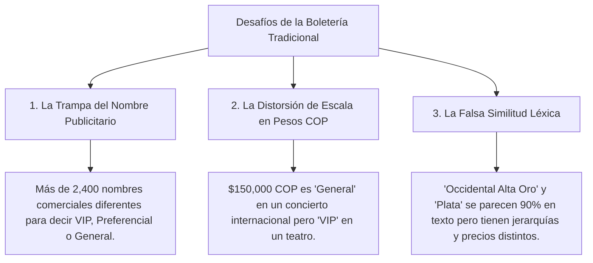
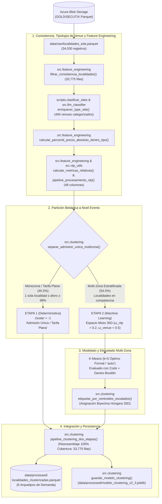
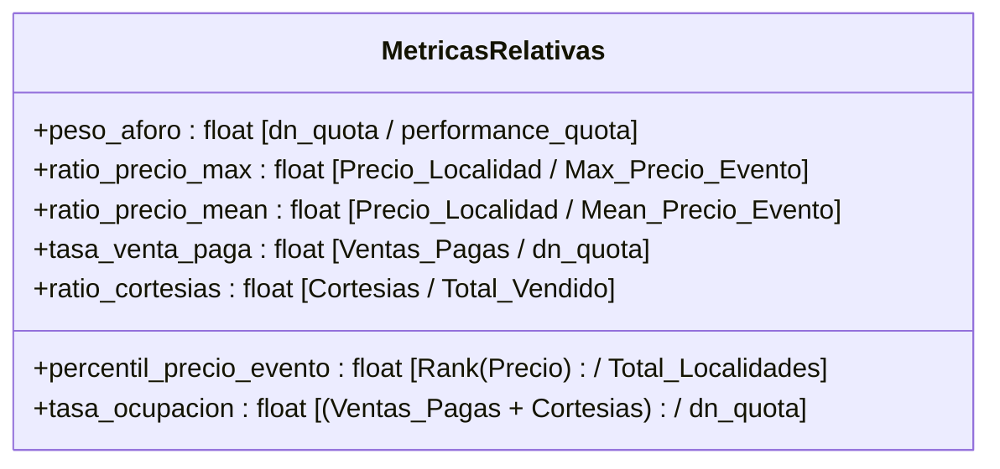

# Documentación Arquitectónica y Metodológica: Clusterización y Estandarización de Localidades

> **Proyecto:** Segmentación y Clasificación Inteligente de Localidades de Boletería  
> **Compañía:** TuBoleta  
> **Versión del Pipeline:** 2.3 (Pipeline Bietápico: Partición Monozona + Espacio Mixto 35D, ω_nlp=0.2, ω_venue=0.5, k=5)  
> **Autor / Equipo:** Data Science & Machine Learning  

---

## Prólogo: La "Torre de Babel" de la Boletería (Storytelling del Negocio)

Imagina que estás al frente de la estrategia comercial de **TuBoleta**, gestionando eventos en venues completamente dispares: desde un **Estadio El Campín** con capacidad para más de **46,000 personas**, pasando por un **Movistar Arena** para **14,000**, hasta salas de teatro íntimas con aforos de **200 butacas**.

Cada promotor, productor de conciertos o venue nombra sus localidades con total libertad creativa y publicitaria:
* En un concierto de vallenato, la localidad más exclusiva se bautiza como:  
  `"PALCOS CANTINERO - LLEGÓ EL PODER"`.
* En un espectáculo urbano, la entrada exclusiva se llama:  
  `"EXPERIENCIA PASEO DE LA AURORA PLATINO"`.
* En un teatro clásico, la mejor ubicación se denomina:  
  `"PLATEA DELANTERA FILA 1"`.
* En un evento de estadio, una grada alta se etiqueta como:  
  `"OCCIDENTAL ALTA ORO"`, mientras que la fila contigua es `"OCCIDENTAL ALTA PLATA"`.

### Los Tres Grandes Desafíos del Análisis Tradicional:



### La Misión Heroica:
Construir un **Espacio Vectorial Mixto** que:
1. **Desmonte el maquillaje publicitario** mediante Procesamiento de Lenguaje Natural (NLP), extrayendo la arquitectura física y espacial real.
2. **Contextualice matemáticamente cada boleta** en relación a su propio espectáculo y la tipología de su venue (percentiles de precio y peso de aforo).
3. **Agrupe y estandarice automáticamente** cualquier localidad del catálogo en **6 Arquetipos Estandarizados de Demanda (1 Admisión Única + 5 Multi-Zona)**.

---

## Mapa del Flujo Arquitectónico



---

## Detalle Exhaustivo: Módulo por Módulo y Función por Función

A continuación se detalla la razón de existencia, lógica algorítmica y el estado **Antes vs Después** de cada función desarrollada.

---

### MÓDULO 0: Clasificación de Venues y Estandarización de Tipología (`scripts/clasificar_sites.py` & `src/llm_classifier.py`)

Para contextualizar el entorno físico de cada localidad, se implementó un sistema de clasificación estructurado para los 494 venues únicos registrados en TuBoleta, integrando curaduría experta, inferencia LLM y reglas léxicas determinísticas.

* **Arquitectura Bietápica con Agente LLM (Gemini 3.8 Flash Medium):**
  * **Modelo:** Gemini 3.8 Flash Medium (`temperature=0.0`, salida JSON estructurada con campos `type_site`, `confianza`, `justificacion_semantica`).
  * **Inyección de Dependencias:** El cliente LLM está desacoplado mediante protocolo e inyección en `GeminiVenueClassifier`, permitiendo ejecución hermética mediante mocks en la suite de integración continua (CI) sin llamadas a red ni consumo de tokens.
* **Jerarquía Estricta de Precedencia:**
  $$\text{revision\_humana (1.0)} > \text{llm (0.80 - 0.99)} > \text{reglas\_heuristicas (fallback)}$$
* **Verificación Cruzada del Diccionario Emblemático:**
  * El LLM procesa también el `DICCIONARIO_EMBLEMATICO` como pasada de verificación de consistencia.
  * Si el LLM discrepa de la asignación del diccionario, el caso se envía a `site_type_revision_humana.csv` para que la **curaduría humana decida**. El LLM **nunca sobrescribe** una asignación humana o curada por sí solo.
* **Esquema de Trazabilidad y Columnas en Lookup (`site_type_lookup.csv`):**
  * `fuente = "revision_humana"`: Asignaciones de curaduría experta validadas manualmente.
  * `fuente = "llm"`: Asignaciones generadas por el agente LLM, acompañadas de la columna `modelo_llm = "gemini-3.8-flash-medium"`.
  * `fuente = "reglas_heuristicas"`: Fallback determinístico con límites de palabra (`\b`) cuando no hay conexión LLM disponible.
* **Persistencia de Auditoría:**
  * Cada inferencia del LLM se persiste en `data/lookup/audit_llm_venues.jsonl` registrando timestamp, prompt exacto, respuesta cruda en JSON, confianza y justificación semántica.
* **Mecanismos de Protección ante Casos Borde en Reglas:**
  1. **Límites de Palabra Estrictos (`\b`):** Evita falsos positivos por subcadenas (ej. `"BAR"` nunca se activa dentro del topónimo `"BARRANQUILLA"`).
  2. **Prevención de Falsas Raíces:** Términos como `"PARQUEADERO"` o `"PARKING"` se desvían a `"otro"` y nunca activan `"parque_aire_libre"`.
  3. **No Inclusión Inversa:** Un venue genérico como `"SALA 2"` no activa `"SALA 2 CINEMATECA"`; requiere la palabra explícita de cine o teatro, de lo contrario pasa a revisión humana.
  4. **Servicios Automotrices:** Locaciones comerciales como `"BIBLOS CAR WASH"` se catalogan como `"otro"`.

---

### MÓDULO 1: Procesamiento de Lenguaje Natural ([`src/nlp_utils.py`](src/nlp_utils.py))

Este módulo limpia el lenguaje de marketing y extrae el ADN estructural de la localidad.

---

#### 1.1 `normalizar_texto(texto: str) -> str`
* **¿Para qué se crea?**: Para eliminar discrepancias ortográficas, tildes y espacios irregulares.
* **¿Por qué se usa?**: `BALCÓN`, `Balcon` y `balcón  ` deben ser reconocidos como el mismo token.
* **Lógica interna**: Convierte a mayúsculas y descompone caracteres Unicode (`NFD`) removiendo la categoría `Mn` (acentos y tildes).
* **Transformación:**
  * **Antes:** `"  2° Balcón Delantero  "`
  * **Después:** `"2 BALCON DELANTERO"`

---

#### 1.2 `limpiar_ruido_marketing(texto: str) -> str`
* **¿Para qué se crea?**: Para suprimir marcas, nombres de giras musicales, patrocinios y números de silletería internos.
* **¿Por qué se usa?**: En `PALCOS CANTINERO - LLEGÓ EL PODER`, la palabra `"CANTINERO"` o `"LLEGÓ EL PODER"` es el nombre del tour de Silvestre Dangond, no un tipo de asiento. Si la dejamos, el modelo pensará que es una localidad única y no un palco estándar.
* **Lógica interna**: 
  1. Aplica expresiones regulares sobre el diccionario `STOPWORDS_MARKETING` (*SENDÉ, BOMBASTIK, LLEGÓ EL PODER, TA MALO, EL REENCUENTRO, EXPERIENCIA, etc.*).
  2. Elimina rangos numéricos irrelevantes (ej. `302 - 306 & 314 - 318`).
* **Transformación en Datos Reales:**

| Nombre Original (`logical_seat_category`) | Texto Limpio Resultante (`texto_limpio`) | Ruido Eliminado |
| :--- | :--- | :--- |
| `"PALCOS CANTINERO - LLEGÓ EL PODER"` | **`"PALCOS"`** | Nombre de gira eliminado |
| `"SIGO INVICTO - SILLAS VIP"` | **`"SILLAS VIP"`** | Eslogan de promotor eliminado |
| `"PISO 3 - 302 - 306 & 314 - 318"` | **`"PISO 3"`** | Rangos de sillas numéricas borradas |
| `"PALCO NEGRA PULOY SENDÉ"` | **`"PALCO"`** | Patrocinio y nombre de comparsa eliminado |
| `"EXPERIENCIA PASEO DE LA AURORA PLATINO"` | **`"PLATINO"`** | Nombres promocionales removidos |

---

#### 1.3 `extraer_atributos_estructurales(texto: str) -> Dict[str, int]`
* **¿Para qué se crea?**: Para desacoplar el texto en **17 variables binarias ($1$ o $0$)** organizadas en **4 dimensiones ortogonales independientes** (sin solapamientos léxicos ni tokens duplicados entre categorías).
* **¿Por qué se usa?**: Los algoritmos matemáticos como K-Means procesan números, no cadenas de texto. Esta función convierte conceptos semánticos en dimensiones vectoriales estructuradas.
* **Comportamiento Multi-Etiqueta (*Multi-hot Encoding*)**: Una misma localidad puede activar simultáneamente tags en dimensiones independientes (ej. Orientación + Nivel Vertical + Jerarquía Comercial + Restricción), lo cual describe con precisión su naturaleza sin forzarla a una sola etiqueta.
* **Estructura de las 4 Dimensiones Ortogonales (17 variables en total):**
  1. **Dimensión 1: Jerarquía Comercial / Tipo de Asiento (5 tags):**
     * `tag_palco`: `PALCO`, `PALCOS`, `BOX`, `BOXES`, `SUITE`, `SUITES`, `MESA`, `MESAS`
     * `tag_vip`: `VIP`, `PLATINUM`, `PLATINO`, `PREMIUM`, `GOLD`, `DIAMANTE`, `ORO`, `PLATA`
     * `tag_platea`: `PLATEA`, `SILLAS`, `SILLERIA`, `PISTA`, `CANCHA`
     * `tag_preferencial`: `PREFERENCIAL`, `PREFERENTE`, `CENTRAL`, `FRONTAL`
     * `tag_general`: `GENERAL`, `TIQUETE`, `ENTRADA`, `STANDARD`, `NORMAL`, `ADMISION`
  2. **Dimensión 2: Nivel Vertical y Arquitectura del Venue (3 tags):**
     * `tag_balcon`: `BALCON`, `BALCONES`, `MEZZANINE`, `VOLADIZO` *(Exclusivo para estructuras de balcón de teatro; no solapa con pisos)*.
     * `tag_piso_alto`: `ALTA`, `ALTAS`, `PISO 2`, `PISO 3`, `PISO 4`, `PISO 5`, `SEGUNDO PISO`, `TERCER PISO`, `CUARTO PISO`, `POSTERIOR`, `ALTO`.
     * `tag_piso_bajo`: `BAJA`, `BAJAS`, `PISO 1`, `PRIMER PISO`, `PLANTA BAJA`, `DELANTERA`, `PRIMERA FILA`, `BAJO`.
  3. **Dimensión 3: Orientación Espacial y Geografía en el Venue (6 tags):**
     * `tag_occidental`: `OCCIDENTAL`, `OCC`, `OESTE`
     * `tag_oriental`: `ORIENTAL`, `ORI`, `ESTE`
     * `tag_norte`: `NORTE`, `NTE`
     * `tag_sur`: `SUR`
     * `tag_lateral`: `LATERAL`, `LATERALES`, `COSTADO`, `ESQUINA`
     * `tag_vista_parcial`: `VISTA PARCIAL`, `VISIBILIDAD PARCIAL`, `RESTRINGIDA`, `REDUCIDA`, `OBSTRUIDA`, `PILARES`
  4. **Dimensión 4: Restricciones de Acceso y Audiencia (3 tags):**
     * `tag_familiar`: `FAMILIAR`, `FAMILIA`
     * `tag_menores`: `MENORES`, `KIDS`, `NINOS`, `INFANTIL`, `LIBRE DE ALCOHOL`, `CERO ALCOHOL`
     * `tag_movilidad_reducida`: `MOVILIDAD REDUCIDA`, `DISCAPACIDAD`, `PMR`, `SILLA DE RUEDAS`, `ACCESIBLE`
* **Transformación (Ejemplo de registro real multi-dimensional):**
  * **Texto evaluado:** `"OCCIDENTAL ALTA VIP FAMILIAR"`
  * **Diccionario generado:**
    ```python
    {
      # Dimensión 1: Jerarquía Comercial
      "tag_palco": 0,
      "tag_vip": 1,             # Detectó 'VIP'
      "tag_platea": 0,
      "tag_preferencial": 0,
      "tag_general": 0,
      
      # Dimensión 2: Nivel Vertical
      "tag_balcon": 0,          # Ya no solapa erróneamente
      "tag_piso_alto": 1,       # Detectó 'ALTA'
      "tag_piso_bajo": 0,
      
      # Dimensión 3: Orientación Espacial
      "tag_occidental": 1,      # Detectó orientación 'OCCIDENTAL'
      "tag_oriental": 0,
      "tag_norte": 0,
      "tag_sur": 0,
      "tag_lateral": 0,
      "tag_vista_parcial": 0,
      
      # Dimensión 4: Restricciones de Acceso
      "tag_familiar": 1,        # Detectó restricción 'FAMILIAR'
      "tag_menores": 0,
      "tag_movilidad_reducida": 0
    }
    ```

---

#### 1.4 `pipeline_procesamiento_nlp(df: pd.DataFrame, col_nombre: str) -> pd.DataFrame`
* **¿Para qué se crea?**: Es el orquestador que toma el DataFrame y añade la columna `texto_limpio` y las 17 columnas `tag_*`.
* **Transformación del DataFrame:**
  * **Antes:** DataFrame enriquecido con consistencia y tipología de venue (`df_rel` con variables relativas y `type_site`).
  * **Después:** DataFrame con 48 columnas enriquecidas (incluyendo variables numéricas, `texto_limpio`, 17 `tag_*`, `type_site` y percentil absoluto dentro de tipo).

---

#### 1.5 `vectorizar_texto_limpio(textos: pd.Series, max_features: int) -> Tuple[np.ndarray, TfidfVectorizer]`
* **¿Para qué se crea?**: Para generar una matriz de embeddings TF-IDF con unigramas y bigramas `(1, 2)` del texto limpio.
* **¿Por qué se usa?**: Permite que el modelo entienda similitudes como *"platea delantera"* vs *"platea frontal"* más allá de las variables booleanas fijas.
* **Transformación:** Produce una matriz densa $\mathbf{X}_{\text{TFIDF}} \in \mathbb{R}^{N \times 15}$.

---

### MÓDULO 2: Ingeniería de Características Relativas ([`src/feature_engineering.py`](src/feature_engineering.py))

Este módulo resuelve la distorsión del dinero y el tamaño del venue calculando métricas **relativas a cada evento (`t_performance_id`)**.

---

#### 2.1 `filtrar_consistencia_localidades(df: pd.DataFrame) -> pd.DataFrame`
* **¿Para qué se crea?**: Limpia registros inconsistentes o transacciones anómalas (aforos negativos, eventos con aforo 0, montos negativos por devoluciones) y valida que la suma de localidades activas coincida con el aforo total del venue.
* **¿Por qué se usa?**: Entrenar un modelo de clustering con datos inconsistentes desplazaría los centroides hacia valores espurios.
* **Condición de filtrado**:
  ```python
  (dn_quota > 0) & (performance_quota > 0) & (med_unit_amt_itx >= 0) & 
  (net_sold_p_qty >= 0) & (net_sold_c_qty >= 0) &
  (suma_dn_quota_por_evento == performance_quota)
  ```
* **Transformación:**
  * **Filas iniciales:** $34,030$
  * **Filas limpias conservadas:** **$33,775$** en **$18,627$ eventos únicos** (99.25% del catálogo conservado con calidad física 100% certificada).

---

#### 2.2 `calcular_metricas_relativas(df: pd.DataFrame) -> pd.DataFrame`
* **¿Para qué se crea?**: Es el corazón matemático de la normalización del negocio.
* **Variables calculadas y su significado:**



* **Detalle de cada variable:**
  1. **`peso_aforo`**: Si una localidad tiene 500 sillas en un evento de 1,000, su peso es **0.50 (50%)**. Si tiene 500 sillas en un estadio de 45,000, su peso es **0.011 (1.1%)**. Esto diferencia instantáneamente un palco selecto de una tribuna masiva.
  2. **`ratio_precio_max`**: Si la boleta más cara del evento cuesta $1,000,000 y esta localidad cuesta $500,000, el ratio es **0.50**. Si la más cara cuesta $100,000 y esta cuesta $100,000, el ratio es **1.00** (Tope de gama).
  3. **`percentil_precio_evento`**: Ordena las localidades de la misma fecha de menor a mayor precio y devuelve su percentil de **0.0 a 1.0**.
  4. **`tasa_ocupacion`**: Qué porcentaje del aforo asignado a esa localidad se vendió efectivamente ($0.0 = 0\%$, $1.0 = 100\%$ Sold Out).

---

#### 2.2.1 Descomposición Empírica del Ratio de Precio Máximo = 1.0

En el catálogo limpio de $33{,}775$ localidades, el **$58.6\%$ ($19{,}782$ filas)** tiene `ratio_precio_max = 1.0`. Para evitar que el modelo confunda tarifas planas con palcos exclusivos, el pipeline descompone este conjunto:

| Segmento | Variable de Código | Total Registros | % Catálogo Total | Realidad de Negocio y Datos |
| :--- | :--- | :---: | :---: | :--- |
| **Admisión Única** | `filas_peso_1 = (peso_aforo >= 0.99).sum()` | **15,375** | **45.5%** | **Eventos de tarifa plana no zonificados** (Cinemateca de Bogotá >7,000 funciones, YAWA Cali 1,476, Maloka 864, Boom Stand Up 810). Su único precio es automáticamente el máximo. |
| **Multi-Zona Top (Palco/VIP/Platea)** | `filas_ratio_1_multizona = filas_ratio_1 - filas_peso_1` | **4,407** | **13.0%** | **Localidades más costosas en eventos estratificados.** Los datos demuestran que el **61.5%** activa tags directos de alta gama (`tag_platea`: 1,450, `tag_palco`: 842, `tag_preferencial`: 474, `tag_vip`: 401). |
| **TOTAL con Ratio = 1.0** | `filas_ratio_1 = (ratio_precio_max == 1.0).sum()` | **19,782** | **58.6%** | Unión disjunta total ($\text{filas\_peso\_1} + \text{filas\_ratio\_1\_multizona}$). |

* **Comparativa Estadística de Distribuciones: Catálogo Total vs. Solo Eventos Multi-Zona:**

| Variable Normalizada | Media (Catálogo Total) | Mediana (Catálogo Total) | Media (Solo Multi-Zona) | Mediana (Solo Multi-Zona) | Comportamiento en Eventos Zonificados |
| :--- | :---: | :---: | :---: | :---: | :--- |
| **`ratio_precio_max`** | $0.803$ | $1.000$ | **$0.646$** | **$0.671$** | Descompresión continua: gradas ($0.20 - 0.50$), preferenciales ($0.60 - 0.85$) y VIPs ($1.00$). |
| **`percentil_precio_evento`** | $0.776$ | $1.000$ | **$0.588$** | **$0.600$** | Distribución simétrica y balanceada ideal para optimización de centroides en clustering. |
| **`peso_aforo`** | $0.548$ | $1.000$ | **$0.177$** | **$0.111$** | El $75\%$ de las localidades ocupan menos del $24.5\%$ del aforo total del venue. |
| **`tasa_ocupacion`** | $0.181$ | $0.090$ | **$0.234$** | **$0.149$** | Mayor absorción de ventas y dinámica comercial en espectáculos estructurados. |

* **Transformación (Ejemplo comparativo real):**

| Evento | Localidad | Precio COP | Aforo Localidad | Aforo Total Evento | `ratio_precio_max` | `percentil_precio_evento` | `peso_aforo` |
| :--- | :--- | :---: | :---: | :---: | :---: | :---: | :---: |
| **Karol G (Estadio)** | VIP Occidental | $845,000 | 4,080 | 46,678 | **1.00** | **1.00 (100%)** | **0.087 (8.7%)** |
| **Karol G (Estadio)** | Norte Alta | $127,000 | 3,001 | 46,678 | **0.15** | **0.20 (20%)** | **0.064 (6.4%)** |
| **Obra Teatro** | Platea Delantera | $127,000 | 150 | 600 | **1.00** | **1.00 (100%)** | **0.250 (25%)** |

>  **Observa la magia del pipeline:** Aunque la *Norte Alta* de Karol G y la *Platea Delantera* del Teatro cuestan exactamente los mismos **$127,000 COP**, el `ratio_precio_max` y el `percentil_precio_evento` le dicen al modelo que la Platea del Teatro es **VIP / Preferencial (1.00)** y la Norte Alta es **Popular (0.15)**.

---

#### 2.2.2 Análisis de Correlaciones y Validación del Espacio Vectorial

El análisis de correlaciones lineales (Pearson $r$) valida tres propiedades estadísticas cruciales para el clustering:

| Conclusión | Causa Matemática | Beneficio para el Modelo de Clustering |
| :--- | :--- | :--- |
| **1. Independencia del COP** | $r(\text{COP}, \text{Ratio}) = -0.034$ | El modelo se vuelve **invariante a la inflación, al tipo de show y al tamaño del venue**. |
| **2. Oferta y Demanda de Aforo** | $r(\text{Aforo}, \text{Precio}) = -0.247$ | Separa matemáticamente la **exclusividad selecta** de la **capacidad masiva**. |
| **3. No Redundancia** | Todas las correlaciones $\|r\| < 0.85$ | Garantiza que cada variable aporte **información nueva e independiente sin distorsionar la distancia euclidiana**. |

---

#### 2.3 `preparar_dataset_enriquecido(df: pd.DataFrame) -> pd.DataFrame`
* Orquesta el filtrado, el cálculo de métricas relativas y la ejecución del pipeline NLP.
* Retorna el dataset maestro con **44 columnas** listo para vectorización.

---

### MÓDULO 3: Fusión Vectorial y Clustering en Dos Etapas ([`src/clustering.py`](src/clustering.py))

Este módulo implementa la arquitectura en dos etapas (**Modelo v2.3**) para resolver el desacoplamiento de K-Means, aislar la distorsión del blob de tarifa plana e integrar la tipología del venue (`type_site`):

```
                                 CATÁLOGO LIMPIO CERTIFICADO (33,775 Filas)
                                                     │
                                                     ▼
                          Regla de Negocio a Nivel EVENTO (t_performance_id)
                          (nunique == 1 localidad O max(peso_aforo) >= 0.99)
                                                     │
                            ┌────────────────────────┴────────────────────────┐
                            ▼                                                 ▼
               ETAPA 1: ADMISIÓN ÚNICA                           ETAPA 2: MULTI-ZONA
                (15,375 filas, 45.5%)                             (18,400 filas, 54.5%)
                            │                                                 │
                 Asignación Determinística                         TF-IDF Reentrenado (15D × 0.2)
                (Sin distorsión de ML)                           + 4 Numéricas Ex-Ante (con percentil tipo)
                            │                                    + 7 Tags Estructurales Densos
                            ▼                                    + 9 One-Hot type_site (× 0.5)
               "Admisión Única / Tarifa Plana"                                │
                                                                              ▼
                                                                 Espacio Mixto 35D Escalado
                                                                              │
                                                                 K-Means Multi-Zona (k=5)
                                                                              │
                                                                              ▼
                                                                 Etiquetado Geométrico 35D
                                                                 (Hungarian Algorithm 1-a-1)
                                                                              │
                                                                              ▼
                                                                 5 Arquetipos Multi-Zona
                                                                              │
                            └────────────────────────┬────────────────────────┘
                                                     │
                                                     ▼
                                        CATÁLOGO FINAL INTEGRADO
                               (33,775 filas, trazabilidad es_monozona: bool)
                                         6 Arquetipos de Demanda
```

---

#### 3.1 `separar_admision_unica_multizona(df: pd.DataFrame) -> Tuple[pd.DataFrame, pd.DataFrame]`
* **¿Para qué se crea?**: Aísla a nivel evento las funciones de admisión única / tarifa plana ($15,375$ registros, $45.5\%$ del catálogo) de los venues zonificados ($18,400$ registros, $54.5\%$).
* **¿Por qué a nivel evento?**: Evita partir una función entre ambas etapas. Si una función tiene 1 sola localidad o concentra $\ge 99\%$ del aforo en un tiquete general, todo el evento se clasifica de forma determinística.
* **Resultado:** Cobertura matemática exacta: $15,375 + 18,400 = 33,775$ filas certificadas.

---

#### 3.2 `construir_espacio_vectorial_mixto(...) -> Tuple[np.ndarray, Scaler, Vectorizer, List[str]]`
* **¿Para qué se crea?**: Ensambla la matriz $\mathbf{X}_{\text{multi}} \in \mathbb{R}^{18,400 \times 35}$ sobre el subconjunto multi-zona.
* **Componentes del Espacio de 35 Dimensiones (Modelo v2.3):**
  1. **4 Variables Numéricas Continuas Ex-Ante:**
     * `ratio_precio_max`: Precio relativo frente al valor máximo de la función.
     * `percentil_precio_evento`: Posición ordinal percentil dentro de la función.
     * `peso_aforo`: Proporción de silletería frente a la capacidad total del evento.
     * `percentil_precio_absoluto_dentro_tipo`: Percentil del precio promedio histórico de la localidad dentro de todas las localidades registradas bajo su misma tipología de venue (`type_site`). Resuelve la distorsión donde localidades con precio nominal medio/alto en venues pequeños eran catalogadas erróneamente como populares. Si el tipo cuenta con $<50$ localidades históricas (cold start), se asigna neutralmente a $0.50$ con bandera de trazabilidad `flag_cold_start_tipo = 1`.
  2. **7 Tags Estructurales Densos:** 5 de jerarquía comercial (`palco`, `vip`, `platea`, `preferencial`, `general`) y 2 verticales (`balcon`, `piso_alto`) en escala $[0, 1]$.
  3. **9 Categorías One-Hot de Tipología de Venue (`type_site`):** Ponderadas por $\text{peso\_type\_site} = 0.5$ (`arena_cubierta`, `auditorio`, `bar_club`, `centro_eventos_carpa`, `cine_sala_cultural`, `estadio_abierto`, `otro`, `parque_aire_libre`, `teatro`). La categoría `desconocido` se excluye del one-hot para evitar redundancia y preservar la ortogonalidad, manteniendo la bandera booleana `flag_site_desconocido` en el DataFrame.
  4. **15 Términos TF-IDF Reentrenados:** Ajustados exclusivamente sobre los textos limpios de eventos multi-zona, ponderados por $\omega_{\text{nlp}} = 0.2$ para modular desempates léxicos sin distorsionar el bloque geométrico continuo.

* **Ablación Metodológica en Tres Brazos y Descomposición Honesta:**

  Para evaluar de forma transparente el impacto individual de cada componente incorporado al espacio vectorial, se ejecutó una ablación experimental en tres brazos controlados sobre el catálogo multi-zona ($18,400$ registros):

  | Brazo Metodológico | Dimensiones | Silhouette Score | Davies-Bouldin | Calinski-Harabasz | Inercia |
  | :--- | :---: | :---: | :---: | :---: | :---: |
  | **1. v2.2 Base (3 numéricas, 7 tags, 15 TF-IDF)** | **25D** | **0.2495** | **1.2769** | **6,089.0** | **18,748.9** |
  | **2. v2.2 + Percentil Tipo (4 numéricas, 7 tags, 15 TF-IDF)** | **26D** | **0.2243** | **1.4164** | **5,193.7** | **23,447.9** |
  | **3. v2.3 Completo (4 numéricas, 7 tags, 9 one-hot venue, 15 TF-IDF)** | **35D** | **0.2094** | **1.4865** | **4,672.7** | **26,293.5** |

  * **Descomposición del Impacto y Justificación Cualitativa:**
    1. **Efecto de la 4ª Numérica (25D $\to$ 26D):**
       Al incorporar `percentil_precio_absoluto_dentro_tipo`, la silueta desciende de $0.2495$ a $0.2243$. La matriz de transición descompuesta demuestra que esta variable es la causante principal de la **expansión del arquetipo VIP / Palcos / Premium (+74%, de 2,912 a 5,081 registros)**. Esto ocurre porque rescata localidades con precio nominal alto dentro de teatros, auditorios y carpas (que antes colapsaban en Preferencial al evaluarse solo contra el precio pico del espectáculo).
    2. **Efecto del One-Hot de Tipología de Venue (26D $\to$ 35D, $\text{peso} = 0.5$):**
       La inclusión de las 9 dimensiones canónicas de venue modula la silueta de $0.2243$ a $0.2094$ (manteniéndose cómodamente sobre el umbral $>0.20$). Este bloque aporta cohesión de tipología física: estabiliza las localidades intermedias y resuelve anomalías cualitativas de negocio (como las entradas `"General"` de precio elevado en teatros pequeños, de las cuales el $14.3\%$ migra de forma natural fuera de Popular hacia Platea o Preferencial al ser contextualizadas contra la tipología del venue).

---

#### 3.3 `evaluar_rango_k(X: np.ndarray, k_min: int, k_max: int) -> pd.DataFrame`
* **Evaluación Empírica sobre Multi-Zona con Espacio v2.3 ($35\text{D}$):**
  * Para la fase actual, el selector multi-criterio mantiene su rango parsimonioso $k \in \{3 \dots 7\}$, donde $k=5$ maximiza el Score Compuesto Codo-DB ($2.000$).
  * **Evidencia Empírica para la Fase Futura ($k \in \{3 \dots 12\}$):**
    Una auditoría cuantitativa extendida sobre la muestra multi-zona revela el comportamiento de granularidades mayores:

    | $k$ | Inercia | Silhouette Score | Davies-Bouldin | Calinski-Harabasz |
    | :---: | :---: | :---: | :---: | :---: |
    | **3** | $32,361.5$ | $0.2168$ | $1.5345$ | $3,225.2$ |
    | **4** | $28,863.4$ | $0.2173$ | $1.4727$ | $2,821.6$ |
    | **5 (Actual v2.3)** | **$26,293.5$** | **$0.2094$** | **$1.4865$** | **$2,574.1$** |
    | **6** | $24,304.0$ | $0.2062$ | $1.4652$ | $2,397.1$ |
    | **7** | $22,803.7$ | $0.2089$ | $1.5938$ | $2,231.1$ |
    | **8** | $21,510.1$ | $0.2159$ | $1.6276$ | $2,108.4$ |
    | **9** | $20,249.6$ | $0.2209$ | $1.6085$ | $2,044.1$ |
    | **10** | $19,355.7$ | $0.2241$ | $1.6228$ | $1,955.7$ |
    | **11** | $18,587.9$ | $0.2267$ | $1.5154$ | $1,881.6$ |
    | **12** | $17,941.9$ | $0.2270$ | $1.4588$ | $1,804.5$ |

  * **Hallazgo para la Siguiente Fase:** A partir de $k \ge 10$, la silueta repunta hacia $0.227$ y el Davies-Bouldin desciende a $1.458$ en $k=12$. Esto constituye evidencia formal que fundamenta la siguiente fase planificada: exploración rigurosa de $k > 10$ mediante estabilidad bootstrap y etiquetado guiado por datos, sin modificar la cota operativa actual en esta versión.

---

#### 3.4 `etiquetar_por_centroides_escalados(kmeans, feature_names, scaler, peso_nlp=0.2) -> Dict[int, str]`
* **¿Para qué se crea?**: Resuelve el desacoplamiento geométrico entre K-Means y los nombres de arquetipos.
* **¿Cómo opera?**:
  1. Define perfiles ideales de negocio para cada arquetipo en el espacio escalado 35D.
  2. Calcula la matriz de distancias euclidianas entre los centroides reales $\mathbf{c}_k \in \mathbb{R}^{35}$ y los perfiles ideales.
  3. Ejecuta el **Algoritmo Húngaro (*linear sum assignment*)** para garantizar una correspondencia 1 a 1 biyectiva sin duplicidades ni ordenamientos frágiles.

---

#### 3.5 `pipeline_clustering_dos_etapas(df: pd.DataFrame, ...) -> Tuple[...]`
* Orquestador maestro que integra la separación por evento, el modelado multi-zona con $k=5$ óptimo (o modo `"auto"` evaluado con Codo-DB), el etiquetado por centroides y el reensamblaje del catálogo completo con trazabilidad (`es_monozona`, `arquetipo_demanda`).

---

#### 3.6 Persistencia e Inferencia en Producción (`joblib`) y Observabilidad de Confianza
* **`guardar_modelo_clustering(filepath, ...)`**: Serializa el estado completo del pipeline en un artefacto portable `.joblib`:
  * Modelo K-Means ($k=5$) y transformadores ajustados (`RobustScaler`, `TfidfVectorizer`).
  * Modelo probabilístico `GaussianMixture` (con componentes anclados a los centroides K-Means mediante `means_init`).
  * Diccionario de mapeo de arquetipos estandarizados.
  * Distribución empírica de referencia de percentiles por tipo (`distribucion_percentil_tipo`) y vocabulario congelado de categorías de venue (`categorias_type_site`).
  * Histograma de referencia de variables para cálculo de drift (`referencia_drift`) y distribución esperada de arquetipos.
  * Versión explícita del artefacto: `version = "2.3"`.
* **`cargar_modelo_clustering(filepath)`**: Carga el payload validando su versión de compatibilidad (`v2.3`).
* **`predecir_arquetipos_demanda(df, modelo, peso_nlp=0.2) -> pd.DataFrame`**:
  * Ejecuta la inferencia bietápica completa evaluando las nuevas localidades contra la distribución percentil de entrenamiento congelada y enriquece cada localidad con métricas de observabilidad:
    1. **`cluster`**: ID del segmento ($-1$ monozona, $0 \dots 4$ multi-zona).
    2. **`arquetipo_demanda`**: Nombre del arquetipo predicho.
    3. **`score_confianza`**: Margen geométrico relativo $m = (d_2 - d_1) / (d_2 + 10^{-9}) \in [0, 1]$ evaluando la separación entre los dos centroides más cercanos ($1.0$ para monozona).
    4. **`es_frontera`**: Booleano indicando ambigüedad inter-cluster ($m < 0.15$).
    5. **`segundo_arquetipo`**: Nombre del arquetipo competidor alternativo en disputa (`None` para monozona).
    6. **`cobertura_texto`**: Proporción de tokens del nombre presentes en el vocabulario congelado del vectorizador ($\in [0, 1]$).
    7. **`texto_casi_vacio`**: Booleano de alerta ($cobertura < 0.20$) cuando la asignación carece de señal léxica relevante.
    8. **`probabilidad_gmm`**: Certeza posterior evaluada por la mezcla de gaussianas ($1.0$ para monozona).

---

#### 3.7 Protocolo de Monitoreo de Drift Estadístico (PSI) y Criterios de Re-entrenamiento
Para prevenir la degradación silenciosa del modelo ante cambios en la oferta de eventos, políticas de precios o reconfiguraciones de silletería de los venues, el pipeline implementa auditoría continua mediante el **Population Stability Index (PSI)**:

$$\text{PSI} = \sum_{b=1}^{B} \left( \text{actual}_b\% - \text{esperado}_b\% \right) \times \ln\left( \frac{\text{actual}_b\%}{\text{esperado}_b\%} \right)$$

* **Variables de Entrada Monitoreadas:**
  * Cardinales y Ordinales: `ratio_precio_max`, `percentil_precio_evento`, `peso_aforo`, `percentil_precio_absoluto_dentro_tipo`.
  * Tags Estructurales: `tag_palco`, `tag_vip`, `tag_platea`, `tag_preferencial`, `tag_general`, `tag_balcon`, `tag_piso_alto`.
  * Distribución de Salida: Porcentaje observado de cada uno de los 6 arquetipos.
* **Matriz de Decisión y Umbrales Operativos:**
  * **PSI < 0.10 [ESTABLE]:** Distribución consistente con el catálogo histórico. No requiere intervención.
  * **0.10 <= PSI <= 0.25 [REVISAR]:** Desviación moderada en variables específicas. Amerita auditoría de venues o eventos novedosos.
  * **PSI > 0.25 [DRIFT CRITICO]:** Desplazamiento severo de distribución. Alerta prioritaria para re-entrenar el modelo, reajustar el escalador o actualizar el vocabulario.
* **Ejecución Automatizada:**
  El script versionado `scripts/monitorear_drift.py` permite auditar periódicamente lotes nuevos de ingestión emitiendo reportes formateados y códigos de salida para orquestadores.

---

## Los 6 Arquetipos de Demanda (Modelo v2.3 Optimizado)


A partir del pipeline en dos etapas sobre los **33,775 registros**, el catálogo se clasifica en 6 arquetipos nítidos:

```
                                     ▲ Ratio de Precio Relativo
                                     │
             VIP / PALCOS          │          PREFERENCIAL / PLATEA FRONTAL
        (Ratio: 0.81 / Aforo: 5.6%) │     (Ratio: 0.86 / Aforo: 17.1%)
        Mediana: $140,000 COP        │     Mediana: $121,312 COP
                                     │
                                     │          PLATEA GENERAL / INTERMEDIA
                                     │     (Ratio: 0.71 / Aforo: 33.2%)
                                     │     Mediana: $48,200 COP
    ─────────────────────────────────┼─────────────────────────────────► Peso de Aforo
                                     │                                  (% Capacidad)
             POPULAR / BALCÓN      │          GRADA GENERAL MASIVA
        (Ratio: 0.35 / Aforo: 9.4%) │     (Ratio: 0.81 / Aforo: 77.9%)
        Mediana: $44,650 COP         │     Mediana: $66,000 COP
                                     │
═════════════════════════════════════╪══════════════════════════════════════════════
     ADMISIÓN ÚNICA / TARIFA PLANA (Cinemateca, Museos: 15,375 filas | 45.5% | Mediana: $13,572 COP)
```

### Resumen Cuantitativo Consolidado de los 6 Arquetipos (Modelo v2.3):

| Arquetipo Estandarizado | Etapa del Modelo | Registros | % Catálogo | Ratio Precio Promedio | Peso Aforo Promedio | Precio Mediano COP | Localidades Típicas Clasificadas |
| :--- | :---: | :---: | :---: | :---: | :---: | :---: | :--- |
|  **Admisión Única / Tarifa Plana** | Etapa 1 (Determinística) | 15,375 | **45.5%** | **0.99** | **100.0%** | **$13,572** | *Cinemateca Bogotá, Maloka, YAWA, funciones monozona* |
|  **Popular / Balcón / Visibilidad Parcial** | Etapa 2 (Multi-Zona ML) | 5,861 | **17.4%** | **0.35** | **9.4%** | **$44,650** | *Balcón 2do/3er Piso, Grada Alta Posterior, Visibilidad Parcial* |
|  **VIP / Palcos / Premium** | Etapa 2 (Multi-Zona ML) | 5,070 | **15.0%** | **0.81** | **5.6%** | **$140,000** | *Palcos Corporativos, Suites, Mesas VIP, Boxes de lujo* |
|  **Platea General / Intermedia** | Etapa 2 (Multi-Zona ML) | 3,270 | **9.7%** | **0.71** | **33.2%** | **$48,200** | *Platea Media, Balcón Delantero, Localidades intermedias* |
|  **Preferencial / Platea Frontal** | Etapa 2 (Multi-Zona ML) | 3,229 | **9.6%** | **0.86** | **17.1%** | **$121,312** | *Platea 1, Platea Delantera, Sillas Centrales, Preferencial* |
|  **Grada General / Masiva** | Etapa 2 (Multi-Zona ML) | 970 | **2.9%** | **0.81** | **77.9%** | **$66,000** | *Graderías masivas de estadios, Gradas Norte/Sur completas* |
| **TOTAL CATÁLOGO** | **Integración v2.3** | **33,775** | **100.0%** | — | — | — | *Calidad y consistencia física 100% certificada* |

---

## Validación de Casos Complejos del Negocio

El espacio mixto demostró resolver con precisión los problemas de ambigüedad planteados:

1. **`"Occidental Alta Oro"` vs `"Occidental Alta Plata"`**:
   * Ambas comparten los tags `tag_occidental` y `tag_piso_alto`.
   * Sin embargo, el `percentil_precio_evento` de *Oro* ($1.00$) la sitúa en ** VIP / Palcos**, mientras que el de *Plata* ($0.75$) la ubica en ** Preferencial**.
2. **`"Palcos Cantinero"` vs `"Palcos El Reencuentro"`**:
   * El NLP eliminó el ruido publicitario convirtiendo ambas en `"PALCOS"`.
   * El modelo las agrupó correctamente en el arquetipo **VIP / Palcos / Premium** sin crear segmentos duplicados por nombre de gira.
3. **`"Platea Delantera (Teatro)"` vs `"General Norte (Estadio)"`**:
   * A pesar de tener el mismo precio nominal ($120,000 COP), la Platea tiene `ratio_precio_max = 1.0` y queda clasificada como ** Preferencial**, mientras que la General Norte tiene `ratio_precio_max = 0.18` y queda como ** Popular / General**.

---

## Guía Rápida de Ejecución

### 1. Activar el entorno virtual
```bash
source .venv/bin/activate
```

### 2. Ejecutar el pipeline en dos etapas desde Python
```python
import pandas as pd
from src.feature_engineering import filtrar_consistencia_localidades, calcular_metricas_relativas
from src.nlp_utils import pipeline_procesamiento_nlp
from src.clustering import pipeline_clustering_dos_etapas

# 1. Cargar y preparar datos limpios certificados
df_raw = pd.read_parquet("data/raw/localidades_eda.parquet")
df_clean = filtrar_consistencia_localidades(df_raw)
df_rel = calcular_metricas_relativas(df_clean)
df_enriquecido = pipeline_procesamiento_nlp(df_rel)

# 2. Ejecutar pipeline en dos etapas (k=5 óptimo en multi-zona, peso_nlp=0.2)
df_final, kmeans, scaler, tfidf_vec, feature_names, metricas = pipeline_clustering_dos_etapas(
    df_enriquecido,
    n_clusters_multizona=5,
    peso_nlp=0.2,
    random_state=42
)

# 3. Guardar catálogo segmentado con los 6 arquetipos certificados
df_final.to_parquet("data/processed/localidades_clusterizadas.parquet", index=False)
print(f" Segmentación completada exitosamente: {len(df_final):,} filas clasificadas.")
```

### 3. Ejecutar los Cuadernos Interactivos
* **Exploración:** [`notebooks/01_eda_clusterizacion.ipynb`](notebooks/01_eda_clusterizacion.ipynb)
* **Modelado y Clustering:** [`notebooks/02_clustering_espacio_mixto.ipynb`](notebooks/02_clustering_espacio_mixto.ipynb)

---

## Historial de Versiones del Pipeline

| Versión | Arquitectura | Espacio Dimensional | Selección de $k$ | Arquetipos Resultantes |
| :--- | :--- | :--- | :--- | :--- |
| **v1.0** | Monolítica básica | Texto crudo + precio COP | Heurística visual | Agrupaciones sin normalización por evento |
| **v2.0** | Espacio Vectorial Mixto Monolítico | 37D ($\omega_{\text{nlp}}=1.2$) | $k=4$ (distorsionado por 45.5% tarifa plana) | 4 Arquetipos con colapso en Grada General |
| **v2.1** | Pipeline en Dos Etapas | 25D ($\omega_{\text{nlp}}=0.2$) | $k=5$ documentado pero selector en $k=7$ | 6 Arquetipos (separación monozona) |
| **v2.2** | Bietápica con Persistencia e Inferencia | 25D ($\omega_{\text{nlp}}=0.2$, RobustScaler) | $k=5$ unificado por Codo-DB ($2.000$) | 6 Arquetipos Estandarizados certificados con Golden Set, CI y Joblib |
| **v2.3** | **Bietápica con Feature Engineering de Venue (`type_site`)** | **35D (4 numéricas + 7 tags + 9 one-hot venue $\times 0.5$ + 15 TF-IDF $\times 0.2$)** | **$k=5$ (Codo-DB $2.000$; evidencia documentada para $k>10$)** | **6 Arquetipos Estandarizados con sensibilidad a tipología de venue, percentil empírico persistido y Golden Set 100% certificado** |

---

## Micro-clusters (exploración)

### 1. Propósito y Caso de Uso
Se evaluó experimentalmente la viabilidad de generar particiones de grano fino ($k > 10$) sobre las $18,400$ localidades multi-zona en el espacio vectorial unificado de 35 dimensiones. El objetivo del caso de uso es servir como capa de normalización de nombres de localidades por detrás (backend), facilitando mapeos sistemáticos mientras se garantiza que el nombre comercial original (`logical_seat_category`) se preserve inalterado en todo momento.

### 2. Decisión de Negocio y Gobernanza
* **Identificador de Backend:** El `cluster_id` numérico opera estrictamente como la clave primaria de agregación interna.
* **Auto-generación sin Aprobación Humana:** Cualquier etiqueta legible (`label_auto`) se compone automáticamente a partir de los tags estructurales con activación superior al 60% en el centroide y el término TF-IDF dominante (en formato Title Case). Si la pureza estructural es menor al 70% o no existe un término dominante representativo, el sistema asigna la etiqueta de resguardo `hibrido_k{id}`. Esta decisión de negocio elimina cuellos de botella operativos al no requerir compuertas manuales de aprobación (*human-in-the-loop*).
* **Rollup a Nivel v2.3:** Cada micro-cluster preserva su alineación jerárquica con el modelo v2.3 mediante la columna `arquetipo_v23_rollup`, asegurando que las distribuciones y reglas de negocio vigentes no se rompan.

### 3. Script y Protocolo de Evaluación
El script de evaluación reproducible se encuentra en [`scripts/explorar_microclusters.py`](scripts/explorar_microclusters.py). Reutiliza idénticamente las funciones de enriquecimiento y construcción del espacio vectorial mixto v2.3 ($\omega_{\text{nlp}} = 0.2$, $\omega_{\text{venue}} = 0.5$, `RobustScaler` y semillas fijadas en 42).

Se evaluaron tres familias algorítmicas con evaluación estandarizada sobre una submuestra fija de 5,000 filas (`RandomState(42)`):
1. **K-Means:** $k \in \{8, 10, 12, 14, 16\}$ con $n\_init = 15$.
2. **Gaussian Mixture Models (GMM):** $k \in \{8, 10, 12, 14, 16\}$ con covarianza completa (`covariance_type="full"`), $n\_init = 3$ y reporte de BIC.
3. **HDBSCAN:** Grid de densidad con $\text{min\_cluster\_size} \in \{1.0\%, 1.5\%, 2.0\%\}$ de $N$ ($184$, $276$ y $368$ elementos respectivamente) y $\text{min\_samples} = 20\%$ de dicho tamaño.

### 4. Criterios de Aceptación Cuantitativos
Un algoritmo califica formalmente como candidato si satisface simultáneamente tres condiciones:
1. **Pureza de naming** $\ge 0.85$ (medida como la combinación ponderada de pureza de tag estructural dominante y término TF-IDF dominante).
2. **Estabilidad bootstrap-ARI** $\ge 0.85$ (promedio tras 20 remuestreos aleatorios al 80% de los datos contra la partición completa).
3. **Cero clusters degenerados** (ningún cluster con menos del 2% del volumen total multi-zona, es decir, $< 368$ localidades).

### 5. Resumen de Resultados

| Algoritmo | $k$ / Parámetro | $k$ Efectivo | Silueta | Davies-Bouldin | Bootstrap-ARI (std) | Pureza Naming | Clusters Puros ($\ge 85\%$) | Clusters Degenerados | Pasa Criterios |
| :--- | :---: | :---: | :---: | :---: | :---: | :---: | :---: | :---: | :---: |
| K-Means | 8 | 8 | 0.2147 | 1.6273 | 0.7405 (0.130) | 0.6371 | 50.0% | 0 | **No** |
| K-Means | 10 | 10 | 0.2240 | 1.6197 | 0.7875 (0.115) | 0.6704 | 50.0% | 0 | **No** |
| K-Means | 12 | 12 | 0.2235 | 1.4601 | 0.7493 (0.093) | 0.6543 | 50.0% | 0 | **No** |
| K-Means | 14 | 14 | 0.2258 | 1.4866 | 0.7824 (0.076) | 0.6762 | 57.1% | 0 | **No** |
| K-Means | 16 | 16 | 0.2301 | 1.4733 | 0.7823 (0.066) | 0.7200 | 68.8% | 0 | **No** |
| GMM | 8 | 8 | 0.1266 | 3.6441 | 0.7094 (0.106) | 0.7291 | 50.0% | 0 | **No** |
| GMM | 10 | 10 | 0.1208 | 3.8096 | 0.7153 (0.101) | 0.7435 | 40.0% | 2 | **No** |
| GMM | 12 | 12 | 0.0731 | 3.3196 | 0.6422 (0.072) | 0.7268 | 41.7% | 1 | **No** |
| GMM | 14 | 14 | 0.0890 | 3.4479 | 0.6400 (0.055) | 0.7264 | 50.0% | 2 | **No** |
| GMM | 16 | 16 | 0.0798 | 2.7201 | 0.6551 (0.079) | 0.7651 | 56.2% | 4 | **No** |
| HDBSCAN | 1.0% | 25 | 0.2353 | 1.3361 | 0.7863 (0.034) | 0.8637 | 76.0% | 11 | **No** |
| HDBSCAN | 1.5% | 20 | 0.2313 | 1.2716 | 0.5250 (0.006) | 0.8641 | 75.0% | 8 | **No** |
| HDBSCAN | 2.0% | 11 | 0.1705 | 1.5450 | 0.8374 (0.006) | 0.7741 | 90.9% | 0 | **No** |

### 6. Conclusión Técnica y Artefactos
* **Artefacto de Resultados:** [`reports/microclusters_resultados.csv`](reports/microclusters_resultados.csv)
* **Catálogo de Referencia:** [`data/processed/cluster_catalog.csv`](data/processed/cluster_catalog.csv)
* **Dictamen:** Ningún candidato satisfizo simultáneamente los umbrales de pureza ($\ge 0.85$), estabilidad ($\ge 0.85$) y no degeneración ($0$ clusters $<2\%$).
  * En **K-Means**, las particiones son estables (ARI $\approx 0.78$) y no degeneran, pero la pureza máxima alcanza apenas $0.7200$.
  * En **GMM**, la estimación de covarianza completa degrada la compacidad geométrica (silueta $< 0.13$) y produce fragmentación con clusters degenerados.
  * En **HDBSCAN**, si bien los núcleos densos alcanzan purezas léxicas del $86.4\%$, esto ocurre a expensas de descartar entre el $18\%$ y $26\%$ de los datos como ruido/outliers, con una inestabilidad severa (ARI $= 0.5250$ en $1.5\%$) y múltiples clusters degenerados.
* **Decisión de Implementación:** Con base en la evidencia empírica, **no se persiste ningún modelo de micro-clusters ni se altera el pipeline de producción**. El modelo canónico v2.3 ($k=5$) permanece inmutable como la versión certificada para el negocio.


