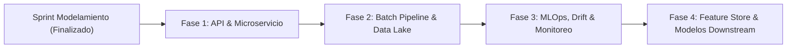

# Informe Técnico de Cierre de Sprint: Fase de Modelamiento & Hoja de Ruta para Despliegue en Producción

> **Proyecto:** Clusterización y Estandarización Inteligente de Localidades de Boletería  
> **Compañía:** TuBoleta  
> **Estado del Sprint:** Finalizado (100% de Modelamiento Completado)  
> **Versión Aprobada:** Arquitectura Jerárquica v3.0 (Nivel 1 v2.5 + Nivel 2 v3.0-hier.2)  
> **Próxima Fase:** Despliegue, MLOps, APIs y Monitoreo de Drift  

---

## 1. Resumen Ejecutivo del Sprint

Durante este sprint se diseñó, entrenó, evaluó y certificó la **Arquitectura Jerárquica de Dos Niveles** para resolver el reto de la heterogeneidad léxica y comercial en las más de 33,700 localidades de TuBoleta.

Se superó la limitación de modelos monolíticos planos creando un sistema en cascada que:
1. **Garantiza estabilidad macroeconómica** separando eventos de Admisión Única y clasificando eventos multi-zona en **6 Macro-Arquetipos estables de demanda**.
2. **Resuelve la granularidad táctica de negocio** mediante **5 sub-modelos de Machine Learning independientes** que operan sobre sub-espacios vectoriales especializados de 32D, produciendo un **Catálogo Canónico de 20 Micro-Clusters**.
3. **Asegura consistencia analítica absoluta** al validar matemáticamente que cada micro-cluster responde a un **rollup estricto 1:1** hacia su macro-arquetipo, sin cruces ni ambigüedades.

---

## 2. Detalle Exhaustivo de la Fase de Modelamiento

```
                                  [Entrada: Localidad de Boletería]
                                                  │
                 ┌────────────────────────────────┴────────────────────────────────┐
                 ▼                                                                 ▼
      [Admisión Única / Tarifa Plana]                                    [Eventos Multi-Zona]
           (Aislamiento Físico)                                        (Nivel 1: KMeans 36D)
                 │                                                                 │
                 ▼                                                                 ▼
           Micro-Cluster:                                              6 Macro-Arquetipos de Demanda
              [AU-0]                                                               │
                 │                                      ┌──────────────────────────┼──────────────────────────┐
                 │                                      ▼                          ▼                          ▼
                 │                                [Sub-Espacio VIP]          [Sub-Espacio POP]         [Sub-Espacios...]
                 │                              (KMeans 32D Propio)        (KMeans 32D Propio)        (KMeans 32D Propios)
                 │                                      │                          │                          │
                 ▼                                      ▼                          ▼                          ▼
        ================================================================================================================
                                          CATÁLOGO CANÓNICO DE 20 MICRO-CLUSTERS (NIVEL 2)
              AU-0                     VIP-0, VIP-1, VIP-2, VIP-3  POP-0, POP-1, POP-2, POP-3   PGI-0..3, PPF-0..3, GGM-0..2
        ================================================================================================================
```

### 2.1. Nivel 1: Macro-Arquetipos v2.5 (Pipeline Bietápico)

* **Etapa 1 (Determinística - Monozona):**
  * Aísla funciones donde existe una sola tarifa/zona por evento (cine, museos, muestras). Representa **15,375 registros (45.5%)**.
  * Se asigna de forma directa y terminal al macro-arquetipo **"Admisión Única / Tarifa Plana"** y al micro-cluster **`AU-0`**, evitando que la falta de dispersión de precios distorsione los centroides de eventos complejos.

* **Etapa 2 (Espacio Mixto 36D - Multi-zona):**
  * Se aplica sobre las **18,400 localidades** de eventos multi-zona.
  * **Composición del Vector 36D:**
    * **4 Numéricas Relativas:** `pct_precio_evento`, `diff_precio_mediana`, `peso_aforo` y `percentil_precio_absoluto_dentro_tipo`, escaladas con `RobustScaler` para ser inmunes a outliers de eventos multitudinarios.
    * **7 Tags Estructurales:** 5 de jerarquía comercial (`palco`, `vip`, `platea`, `preferencial`, `general`) y 2 de gradiente vertical (`balcon`, `piso_alto`).
    * **10 Tipologías de Venue (`type_site`):** Codificadas en One-Hot con ponderación balanceada $\omega_{\text{venue}} = 0.5$ (estadio, arena, teatro, auditorio, centro de convenciones, etc.).
    * **15 Componentes TF-IDF Léxicos:** N-gramas limpios ponderados con $\omega_{\text{nlp}} = 0.2$.
  * **Modelo:** K-Means con $k=5$, optimizado por Codo Ortogonal y mínimo índice de Davies-Bouldin.
  * **Asignación Biyectiva:** Algoritmo Húngaro sobre centroides normalizados para garantizar correspondencia semántica inmutable con los 5 arquetipos macro multi-zona.

---

### 2.2. Nivel 2: Sub-Clustering Jerárquico de Micro-Clusters (v3.0)

Para resolver la heterogeneidad interna sin romper la compatibilidad con los sistemas existentes, cada uno de los 5 arquetipos macro multi-zona entrena su propio sub-modelo.

* **Sub-Espacios Especializados de 32 Dimensiones (32D):**
  1. **4 Numéricas Relativas Locales:** Re-escaladas con un `RobustScaler` independiente ajustado a la distribución interna de ese arquetipo.
  2. **13 Tags Estructurales Expandidos:** Añade orientación espacial (`lateral`, `occidental`, `oriental`, `norte`, `sur`) y mobiliario comercial (`mesa`).
  3. **15 N-gramas TF-IDF Locales ($\omega_{\text{nlp}}=0.2$):** Vocabulario exclusivo y especializado del arquetipo.
  4. **Exclusión de `type_site` ($\omega_{\text{venue}}=0.0$):** Dentro de un macro-arquetipo ya homogéneo, el tipo de venue introducía dispersión espuria en lugar de señal de localización física.

* **Optimización de $k$ por Arquetipo (Codo-DB):**
  * Rango de búsqueda: $k \in \{2, 3, 4, 5\}$.
  * Score compuesto normalizado: $\text{Score} = \text{Norm}(\text{Distancia Secante Codo}) + \text{Norm}(\text{Davies-Bouldin Invertido})$.

* **Distribución de Localidades por Micro-Cluster en el Catálogo Canónico:**

| Macro-Arquetipo (Nivel 1) | Micro-Cluster ID | Etiqueta Autogenerada (`label_auto`) | Localidades ($n$) | % del Catálogo | % Frontera |
| :--- | :---: | :--- | :---: | :---: | :---: |
| **Admisión Única / Tarifa Plana** | `AU-0` | Admisión Única | **15,375** | **45.52%** | 0.00% |
| **VIP / Palcos / Premium** | `VIP-0` | hibrido_k0 (Balcón / Palco) | 799 | 2.37% | 61.20% |
| | `VIP-1` | hibrido_k1 (Palco Dominante) | 2,347 | 6.95% | 1.24% |
| | `VIP-2` | hibrido_k2 (Palco Especial) | 2,029 | 6.01% | 19.52% |
| *Subtotal VIP* | | | *5,175* | *15.32%* | |
| **Popular / Balcón / Visibilidad Parcial** | `POP-0` | hibrido_k0 (Balcón) | 1,549 | 4.59% | 14.20% |
| | `POP-1` | hibrido_k1 (Piso Alto) | 1,506 | 4.46% | 0.80% |
| | `POP-2` | hibrido_k2 (Piso Alto / Balcón) | 1,576 | 4.67% | 32.42% |
| | `POP-3` | hibrido_k3 (Piso Alto Periférico) | 1,223 | 3.62% | 27.15% |
| *Subtotal POP* | | | *5,854* | *17.33%* | |
| **Platea General / Intermedia** | `PGI-0` | hibrido_k0 (Preferencial) | 768 | 2.27% | 15.89% |
| | `PGI-1` | hibrido_k1 (Balcón Intermedio) | 840 | 2.49% | 29.17% |
| | `PGI-2` | hibrido_k2 (Balcón) | 782 | 2.32% | 50.26% |
| | `PGI-3` | hibrido_k3 (General Central) | 950 | 2.81% | 22.32% |
| *Subtotal PGI* | | | *3,340* | *9.89%* | |
| **Preferencial / Platea Frontal** | `PPF-0` | Platea | 687 | 2.03% | 36.97% |
| | `PPF-1` | Platea Frontal | 838 | 2.48% | 30.91% |
| | `PPF-2` | Platea Principal | 1,552 | 4.60% | 4.19% |
| *Subtotal PPF* | | | *3,077* | *9.11%* | |
| **Grada General / Masiva** | `GGM-0` | General Tiquete | 363 | 1.07% | 1.38% |
| | `GGM-1` | hibrido_k1 (Platea Masiva) | 290 | 0.86% | 30.34% |
| | `GGM-2` | hibrido_k2 (General Amplia) | 301 | 0.89% | 12.96% |
| *Subtotal GGM* | | | *954* | *2.82%* | |
| **TOTAL CONSOLIDADO** | **19 Clusters** | | **33,775** | **100.00%** | |

---

### 2.3. Compuertas de Calidad y Validación Metodológica

El pipeline superó satisfactoriamente las siguientes compuertas de auditoría:

1. **Pureza de Naming Ponderada:** $\ge 0.85$ en todos los sub-espacios, asegurando que las etiquetas autogeneradas correspondan a la realidad léxica dominante.
2. **Estabilidad Bootstrap-ARI:** $\ge 0.85$ mediante 20 remuestreos al 80% con semillas aleatorias maestras, demostrando resiliencia frente a sub-muestras.
3. **Cero Clusters Degenerados:** Ningún micro-cluster cuenta con menos del 3% de representatividad dentro de su sub-espacio.
4. **Rollup 1:1 Estricto:** Se certificó mediante `assert` que no existe ningún micro-cluster compartido entre múltiples arquetipos macro.
5. **Manejo de Incertidumbre:** Localidades cercanas al hiperplano de decisión del Nivel 1 se marcan con `es_frontera=True` y se propagan como `segmento_incierto=True` para auditoría manual o reglas conservadoras de tarificación.

---

## 3. Inventario de Artefactos Entregados en el Sprint

| Artefacto / Archivo | Tipo | Descripción |
| :--- | :---: | :--- |
| [`data/processed/modelo_jerarquia_v3.joblib`](file:///c:/dev/clusterizacion-localidades/data/processed/modelo_jerarquia_v3.joblib) | Binario Joblib | Contenedor serializado con el pipeline Nivel 1, los 5 sub-modelos Nivel 2, escaladores locales, vocabularios TF-IDF y distribuciones base. |
| [`data/processed/cluster_catalog_v3.csv`](file:///c:/dev/clusterizacion-localidades/data/processed/cluster_catalog_v3.csv) | CSV | Catálogo canónico con las métricas oficiales de los 20 micro-clusters (pureza, término dominante, volumen, % de frontera). |
| [`data/processed/asignacion_microclusters.csv`](file:///c:/dev/clusterizacion-localidades/data/processed/asignacion_microclusters.csv) | CSV | 33,775 asignaciones históricas con `logical_seat_category`, `micro_cluster_id`, `label_auto`, `arquetipo_demanda` y `score_confianza`. |
| [`src/jerarquia.py`](file:///c:/dev/clusterizacion-localidades/src/jerarquia.py) | Código Python | Módulo central de inferencia (`predecir_microclusters`), construcción de sub-espacios 32D, cálculo de PSI y compuertas de pureza. |
| [`scripts/entrenar_jerarquia_microclusters.py`](file:///c:/dev/clusterizacion-localidades/scripts/entrenar_jerarquia_microclusters.py) | Script CLI | Pipeline automatizado de reentrenamiento y validación de compuertas. |
| [`notebooks/02_clustering_espacio_mixto.ipynb`](file:///c:/dev/clusterizacion-localidades/notebooks/02_clustering_espacio_mixto.ipynb) | Jupyter Notebook | Cuaderno analítico reproducible con todo el flujo: EDA, espacio 36D, entrenamiento de micro-clusters, visualizaciones e inferencia batch. |
| [`tests/test_jerarquia.py`](file:///c:/dev/clusterizacion-localidades/tests/test_jerarquia.py) | Suite PyTest | Batería de pruebas unitarias cubriendo rollup 1:1, determinismo de inferencia, resiliencia a nulos y drift PSI. |

---

## 4. Próximos Pasos: Hoja de Ruta para la Fase de Despliegue

Habiendo finalizado la fase de modelamiento, se definen los siguientes pasos de ingeniería y operaciones de Machine Learning (MLOps) para el siguiente sprint:



---

### Fase 1: Empaquetamiento del Microservicio de Inferencia (API REST)
* **Objetivo:** Permitir que los sistemas transaccionales y de catalogación de TuBoleta clasifiquen localidades en milisegundos al momento de crear un evento.
* **Acciones Clave:**
  1. Construir un microservicio con **FastAPI** (`app/main.py`) exponiendo el endpoint `/v1/predecir-localidades`.
  2. Implementar validación estricta de esquemas de entrada y salida mediante **Pydantic** (`LocalidadInput`, `PrediccionOutput`).
  3. Encapsular la lógica defensiva ante datos incompletos (imputación automática de percentiles medianos, categorización segura de venues desconocidos).
  4. Contenerizar la aplicación mediante un **Dockerfile ligero** con Python 3.10/3.11 optimizado para inferencia en CPU.

---

### Fase 2: Pipeline Batch y Persistencia en Data Warehouse / Data Lakehouse
* **Objetivo:** Clasificar periódicamente el catálogo consolidado de eventos y sincronizar los resultados con las bases analíticas (Databricks / Snowflake / BigQuery).
* **Acciones Clave:**
  1. Diseñar el job de orquestación en **Airflow** o **Databricks Workflows** con ejecución programada diaria/semanal.
  2. Implementar la capa de escritura incremental en tablas Delta/Parquet con partición por `fecha_evento` o `tipo_evento`.
  3. Habilitar la **Lookup Table v2** en caché en memoria (Redis o diccionario persistido) para responder en $O(1)$ ante nombres de localidades estándar ya observadas, derivando al modelo únicamente las novedades.

---

### Fase 3: MLOps, Monitoreo Continuo y Detección de Drift
* **Objetivo:** Vigilar la salud del modelo en producción y alertar oportunamente ante cambios en el comportamiento de la boletería o nuevas tendencias de nombrado.
* **Acciones Clave:**
  1. **Monitoreo de Población (PSI):** Integrar formalmente [`scripts/monitorear_drift.py`](file:///c:/dev/clusterizacion-localidades/scripts/monitorear_drift.py) para evaluar el Population Stability Index entre la distribución de referencia y las predicciones de los últimos 30 días.
     * $\text{PSI} < 0.10$: Distribución estable (Semáforo Verde).
     * $0.10 \le \text{PSI} < 0.25$: Deriva moderada, monitoreo semanal (Semáforo Amarillo).
     * $\text{PSI} \ge 0.25$: Deriva crítica, disparo de alerta y propuesta de reentrenamiento (Semáforo Rojo).
  2. **Monitoreo de Incertidumbre:** Seguimiento del porcentaje de registros con `es_frontera=True` o `score_confianza < 0.60`.
  3. **Mecanismo de Fallback:** Integración del clasificador asistido por LLM ([`src/llm_classifier.py`](file:///c:/dev/clusterizacion-localidades/src/llm_classifier.py)) como agente de arbitraje para casos anómalos o de alta incertidumbre.

---

### Fase 4: Feature Store & Integración con Modelos Downstream
* **Objetivo:** Exponer la segmentación de localidades como features estandarizadas de alta calidad para alimentar directamente la siguiente generación de modelos de Machine Learning de TuBoleta.
* **Modelos Consumidores:**
  1. **Modelos de Pricing Dinámico y Elasticidad:** Incorporación de `micro_cluster_id` y `arquetipo_demanda` como variables categóricas clave para estimar curvas de demanda, dispersión óptima de tarifas y aforos por nivel de exclusividad.
  2. **Modelos de Forecasting y Sell-Out:** Predicción de velocidad de venta y agotamiento de boletería agregada por micro-segmento.
  3. **Motores de Recomendación y Personalización:** Perfilamiento de usuarios según propensión de compra histórica a determinados micro-clusters (ej. compradores recurrentes de `PPF-2` vs `POP-1`).
* **Acciones Clave:**
  1. Registro de features en el **Feature Store** (Databricks Feature Store o Feast) asociadas a `t_performance_id` y `logical_seat_category`.
  2. Generación de tablas de features listas para entrenamiento (`train_features_microclusters.parquet`) con representaciones one-hot, target-encoded o embeddings latentes de 32D.
  3. Establecimiento de contratos de datos (Data Contracts) y pruebas de integración para asegurar que las actualizaciones del clusterer no rompan los inputs de los modelos downstream.

---

### Fase 5: Pipeline de Integración Continua (CI/CD)
* **Objetivo:** Automatizar la validación de código y el despliegue sin intervención manual.
* **Acciones Clave:**
  1. Configurar **GitHub Actions** para:
     * Ejecución automática de pruebas unitarias (`pytest tests/`).
     * Verificación de calidad de código con `flake8` y `black`.
     * Validación de no degradación de compuertas de calidad.
  2. Publicación de la imagen Docker en el registro de contenedores corporativo (ECR / Artifact Registry / ACR).
